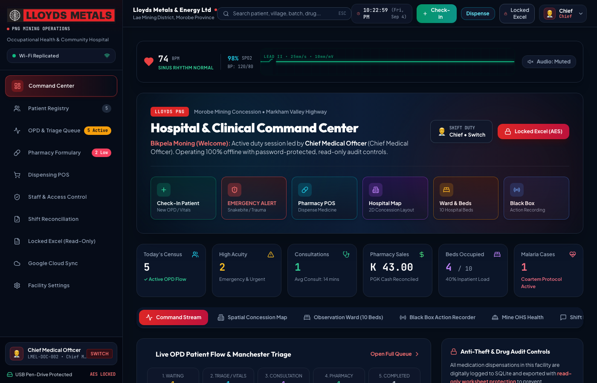
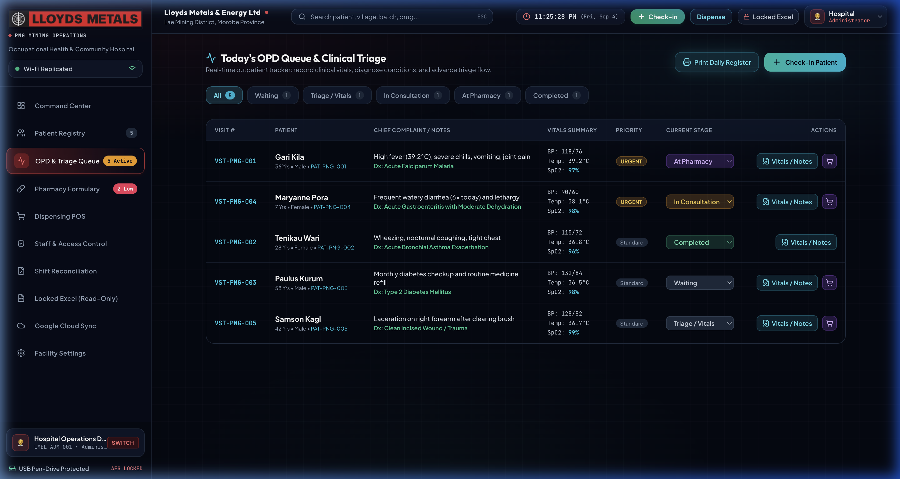
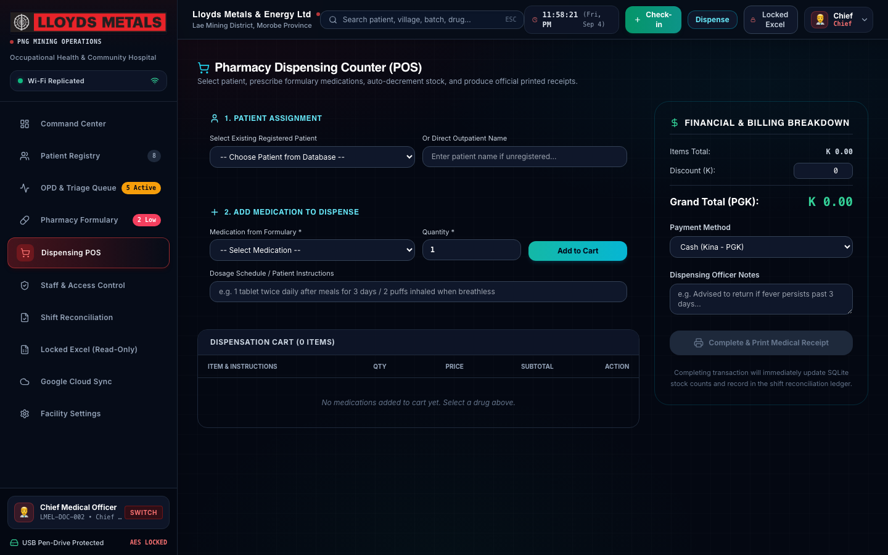
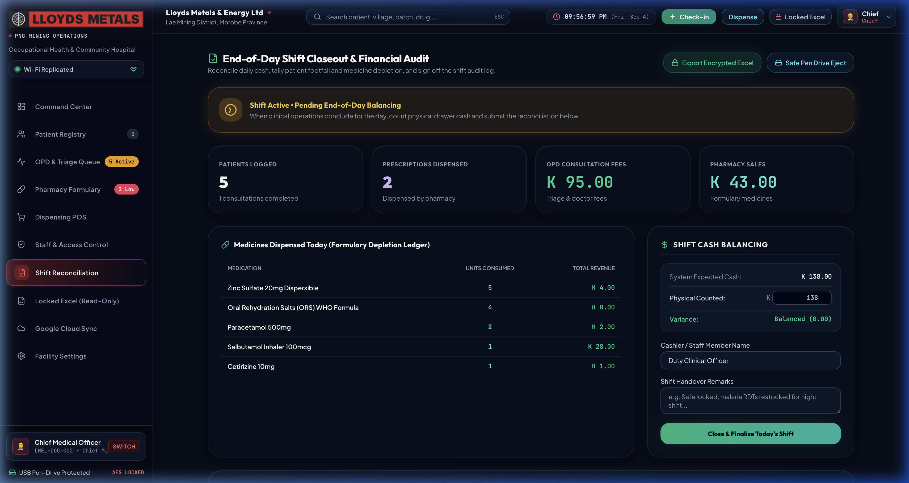

<div align="center">

# 🏥 Lloyds Medical OS

**A complete, offline-first hospital and clinic management system built for remote worksites, mining concessions, and community health centers.**

Runs 100% locally from any laptop or USB drive — zero cloud, zero internet, and zero external database setup required.

[Quick Start](#-quick-start) • [What It Does](#-what-does-this-program-do) • [Default Logins](#-default-logins) • [Screenshots](#-screenshots) • [Tech Stack](#-tech-stack) • [How Data Is Saved](#-where-is-data-stored)

---

</div>

## 💡 Why Lloyds Medical OS?

Most modern hospital software requires constant high-speed internet, cloud subscriptions, and complicated server setups. In remote mining camps, exploration sites, and rural clinics, internet connectivity frequently drops for days or weeks.

**Lloyds Medical OS solves this problem:**
- **Works 100% Offline:** You can run it on a laptop in the middle of the jungle with no internet connection.
- **Instant Setup:** Just double-click a launcher or run one command — no Docker, MySQL, or cloud needed.
- **Multi-Device over Local Wi-Fi:** Doctors, triage nurses, and pharmacists can all use their own laptops or tablets connected to the same clinic Wi-Fi router, even with no internet access.
- **Zero-Loss Accountability:** All patient records, pharmacy sales, and cash collections are saved to a local database and can be exported as password-protected Excel audit sheets.

---

## 🚀 Quick Start

You can get the entire system running in less than 60 seconds.

### Option 1: 1-Click Launch (No coding required)

If you downloaded the folder or are running from a USB drive:

- **Windows:** Double-click `Start_Hospital_Windows.bat`
- **Mac:** Double-click `Start_Hospital_Mac.command`

> 💡 **Zero Setup Required:** If Node.js or packages are missing on a new computer, the launcher automatically downloads and sets up everything in the background, creates a desktop shortcut (`Lloyds Medical OS`), and opens the browser for you!

Your web browser will open automatically to **`http://localhost:4000`**.

---

### Option 2: Run with Terminal (For Developers)

Make sure you have [Node.js](https://nodejs.org/) (v18+) installed:

```bash
# 1. Clone the repository
git clone https://github.com/kritinrautela/lloyds-medical-os.git
cd lloyds-medical-os

# 2. Install all dependencies (Backend + Frontend)
npm run setup

# 3. Start the application
npm start
```

Open **`http://localhost:4000`** in your browser.

> **Tip for Developers:** To run with hot-reload during coding, use `npm run dev`.

---

## 🔑 Default Logins

The system comes pre-configured with 4 ready-to-use staff accounts. All accounts use the same password: **`lloyds2026`**

| Role | Username | Password | What this account does |
| :--- | :--- | :--- | :--- |
| **Doctor / Medical Lead** | `doctor` | `lloyds2026` | Patient consultations, diagnoses, electronic prescriptions, inpatient admissions |
| **Triage Nurse** | `triage_officer` | `lloyds2026` | Patient check-in, vital signs intake (BP, pulse, SpO2, temp), urgent triage sorting |
| **Pharmacist** | `pharmacist` | `lloyds2026` | Medication dispensing, inventory stock counts, batch expiry, Kina cash register |
| **Administrator** | `admin` | `lloyds2026` | Manage staff accounts, reset passwords, change clinic settings, purge demo data |

*(You can create new staff accounts or change passwords anytime from the **Staff Management** page).*

---

## 📋 What Does This Program Do?

Lloyds Medical OS provides an end-to-end clinical workflow from the moment a patient walks in until their medicine is dispensed and the day's cash is counted:

```
[ 1. Check-In ] ──► [ 2. Triage & Vitals ] ──► [ 3. Doctor Consult ] ──► [ 4. Pharmacy & POS ] ──► [ 5. Shift Balancing ]
```

### 1. 🗂️ Patient Registry & Unique ID
- Register new patients in 10 seconds.
- Automatically assigns a unique, date-stamped patient code (e.g. `LMEL-20260906-001`) so patients with similar names are never confused.
- Generates printable digital patient passes and complete medical dossiers.

### 2. 🩺 Triage & Live Vital Signs
- Record Blood Pressure, Heart Rate, Oxygen Saturation (SpO2), Core Temperature, and Respiration.
- Automatic urgency flags for fever, hypertension, tachycardia, and low oxygen.
- Real-time telemetry monitor showing clinic status.

### 3. 👨‍⚕️ Doctor Consultation Suite
- See the live waiting queue of triaged patients.
- Review past medical history and allergies.
- Record clinical notes, physical examination findings, and ICD diagnoses.
- Authorize electronic prescriptions directly sent to the dispensary.

### 4. 💊 Pharmacy, Stock Control & POS Cashier
- Pre-loaded with over 50 essential medicines (antimalarials, antibiotics, IV fluids, pain relief).
- Automatic stock deduction when medication is dispensed.
- Tracks batch numbers, low-stock warnings, and expiration dates (FEFO).
- Built-in Point of Sale (POS) cashiering that collects fees in PNG Kina (PGK) and prints bilingual receipts.

### 5. 🛏️ Observation Bays & Trauma Beds
- Live status of 10 observation beds and trauma bays (Resuscitation Bay, Snakebite/Toxicology Bay, Mine Occupational Health Bay, Tropical Ward).
- Aeromedical medevac readiness tracking for emergency helicopter evacuation.

### 6. 💰 End-of-Day Financial Balancing
- Reconciles total consultation fees + pharmacy sales against physical cash in the clinic safe.
- Enforces zero-variance balancing (`0.00`) before shift closure to prevent theft and drug diversion.
- Prints an official A4 Shift Audit Sheet ready for doctor and supervisor signatures.

### 7. 🔒 Tamper-Proof Black Box & Encrypted Excel
- **Black Box Recorder:** Every check-in, prescription change, login, and setting update is logged with exact time and staff name.
- **AES-256 Encrypted Excel:** Export full clinical and financial data into a password-protected multi-tab Excel workbook (decryption PIN: `lloyds2026`).

---

## 📸 Screenshots

| Command Center & Clinical Dashboard | OPD Triage Queue |
| :---: | :---: |
|  |  |

| Pharmacy Formulary & Dispensing POS | End-of-Day Financial Shift Balancing |
| :---: | :---: |
|  |  |

---

## 📶 Using Tablets & Multiple Computers on Clinic Wi-Fi

You can connect tablets, phones, and secondary laptops in the clinic **without any internet**:

1. Connect the host computer and your tablets to the **same Wi-Fi router** (the router does not need to be plugged into the internet).
2. Find the IP address of the main computer running the system:
   - On Windows: Run `ipconfig` in Command Prompt (e.g. `192.168.1.50`)
   - On Mac: Check System Settings > Wi-Fi Details
3. On your tablets or laptops, open the browser and go to:
   ```
   http://192.168.1.50:4000
   ```
   *(Replace with your computer's actual IP address)*

Now the Triage Nurse, Doctor, and Pharmacist can all work on their own screens simultaneously!

---

## 💾 Where Is Data Stored?

Everything is saved locally on your computer in a single file:
```
server/data/hospital.db
```
- **Engine:** SQLite 3 with Write-Ahead Logging (WAL) enabled.
- **Safety:** Even if the power cuts or the computer abruptly shuts down, your data is safe and will not corrupt.
- **Privacy:** No patient records or financial numbers are ever sent to external cloud servers.
- **Clearing Demo Data:** If you want to wipe sample test data and start fresh for a real clinic, go to **Facility Settings** and click **"Purge Demo Data & Start Clean"**.

---

## 🛠️ Tech Stack

- **Frontend:** [React 18](https://react.dev/), [Vite](https://vitejs.dev/), [Tailwind CSS](https://tailwindcss.com/), Lucide Icons
- **Backend:** [Node.js](https://nodejs.org/), [Express.js](https://expressjs.com/)
- **Database:** [SQLite 3](https://www.sqlite.org/) (WAL mode)
- **Reporting:** `excel4node` (AES-256 encrypted multi-tab Excel workbooks)
- **Printing:** Standard CSS Paged Media for 80mm thermal receipts and A4 audit certificates

---

## 📁 Project Structure

```text
lloyds-medical-os/
├── Start_Hospital_Windows.bat   # 1-Click launcher for Windows
├── Start_Hospital_Mac.command   # 1-Click launcher for Mac
├── Safe_Pen_Drive_Eject.bat     # Flushes database safely before USB removal
├── client/                      # React frontend application
│   ├── src/
│   │   ├── pages/               # Dashboard, Patients, Triage, Pharmacy, POS, Settings
│   │   ├── components/          # Modals, Navbar, Sidebar, Telemetry cards
│   │   └── services/api.js      # Local API connection
├── server/                      # Node.js backend & SQLite database
│   ├── data/hospital.db         # The single SQLite database file holding all data
│   ├── routes/                  # API endpoints (patients, visits, drugs, auth, etc.)
│   └── server.js                # Express web server
└── docs/                        # Complete 20-page executive PDF manual and assets
```

---

## 📖 Full Executive Manual

For formal hospital documentation, clinical protocols, and accreditation details, see:
- 📄 **[Executive Manual (20-Page PDF)](docs/Lloyds_Medical_OS_Executive_Manual.pdf)**
- 🏥 **[Clinical Staff Protocol Guide](README_HOSPITAL_STAFF.md)**
- 💾 **[USB Pen-Drive Quick Instructions](00_START_HERE.txt)**

---

## 🏢 Organization & License

Built for **Lloyds Metals & Energy Limited (LMEL)**  
Occupational Health, Mining Concessions & Community Health Division.  
*All rights reserved.*
