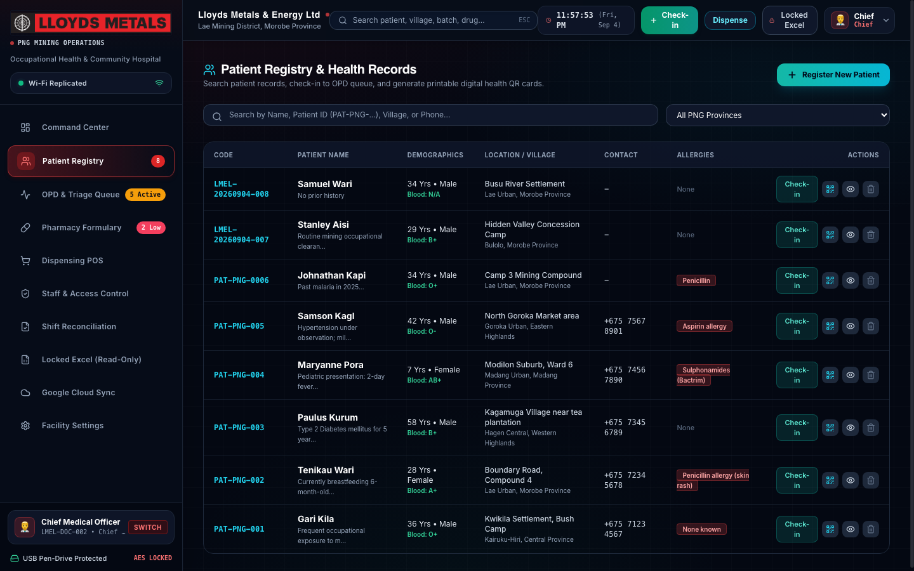
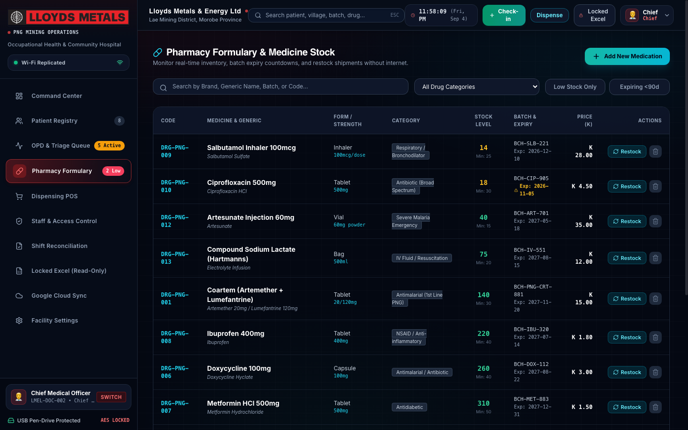
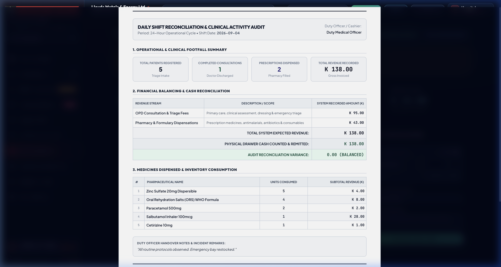
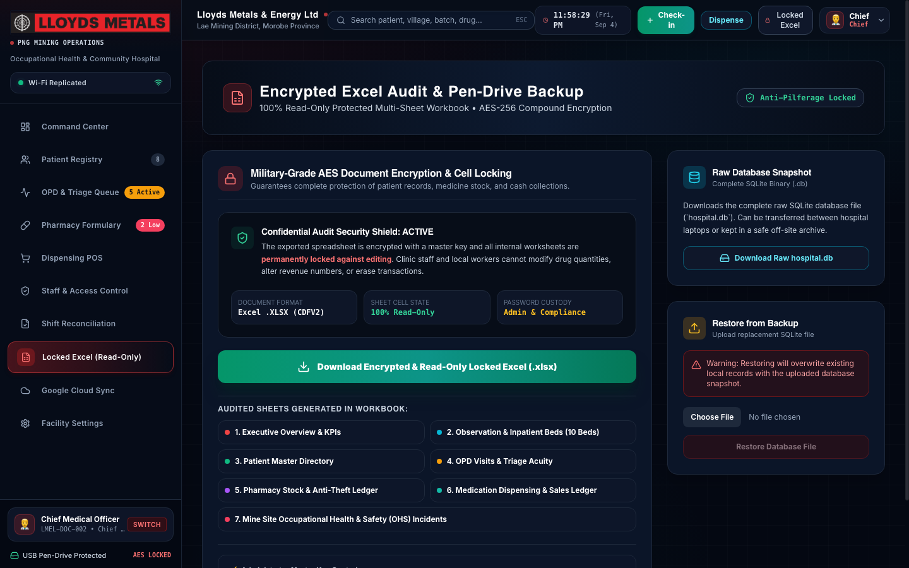
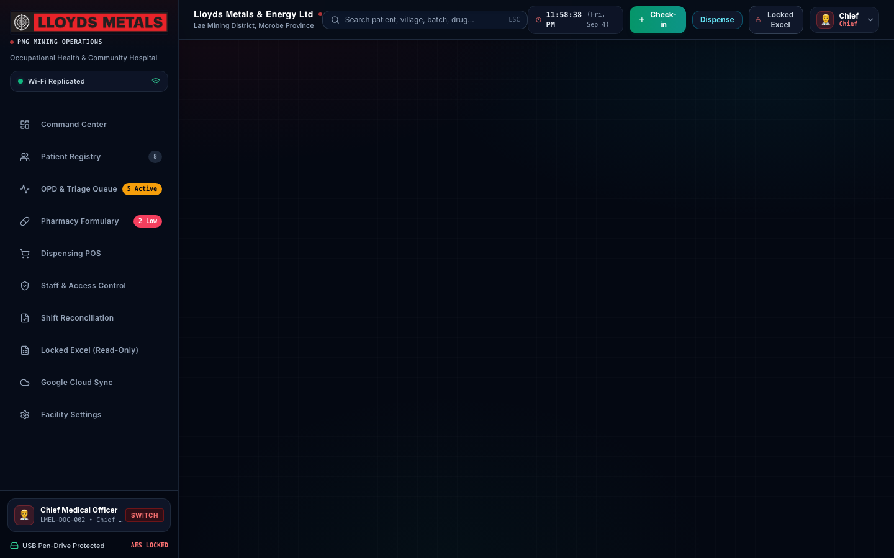

# Lloyds Medical Operating System (LMOS-PNG)
### Occupational Health, Trauma & Community Hospital Platform — Remote Concessions Edition
**Lloyds Metals & Energy Limited** • *Document Ref: LMEL-TECH-2026-V3.0-MASTER | Concession Ref: PNG-MOH-LMEL-2026*

---

[](https://github.com/kritinrautela/lloyds-medical-os)
[](https://github.com/kritinrautela/lloyds-medical-os)
[-003B57?style=for-the-badge&logo=sqlite)](https://github.com/kritinrautela/lloyds-medical-os)
[](https://github.com/kritinrautela/lloyds-medical-os)
[](https://github.com/kritinrautela/lloyds-medical-os)
[](https://github.com/kritinrautela/lloyds-medical-os)
[](https://github.com/kritinrautela/lloyds-medical-os)
[](docs/Lloyds_Medical_OS_Executive_Manual.pdf)

---

## ⚡ Quick Start: How to Install & Run Easily

The **Lloyds Medical Operating System (LMOS-PNG)** is an **offline-first, zero-cloud** medical platform. You do not need Docker, external database servers, or cloud subscriptions to run it. Everything is self-contained.

### 🌟 Method 1: 1-Click Desktop Launchers (Easiest — Zero Terminal)

If you downloaded the folder or plugged in the clinic USB drive, double-click the script for your computer:

| Platform | Launcher File | Instructions |
| :--- | :--- | :--- |
| **🪟 Windows** | [`Start_Hospital_Windows.bat`](Start_Hospital_Windows.bat) | Double-click `Start_Hospital_Windows.bat`. It checks Node.js, boots the SQLite server, and opens your browser automatically. |
| **🍎 macOS / Linux** | [`Start_Hospital_Mac.command`](Start_Hospital_Mac.command) | Double-click `Start_Hospital_Mac.command`. If prompted on first run, grant execution permission: `chmod +x Start_Hospital_Mac.command`. |

---

### 💻 Method 2: Fast Terminal Setup (2 Minutes)

#### Prerequisites
- **Node.js** (v18.0 or higher) installed. If needed, download free at [nodejs.org](https://nodejs.org).
- **Git** (optional, to clone).

```bash
# 1. Clone the repository
git clone https://github.com/kritinrautela/lloyds-medical-os.git
cd lloyds-medical-os

# 2. One-click dependency install (Backend + Frontend)
npm run setup

# 3. Launch the Medical Operating System
npm start
```

* **Desktop Application URL:** [`http://localhost:4000`](http://localhost:4000) (Production build) or [`http://localhost:5173`](http://localhost:5173) (Vite dev)
* **Clinic Wi-Fi / Tablets:** `http://<YOUR_LOCAL_IP>:4000` (Allows any tablet or mobile device in the clinic to connect without internet)
* **Local SQLite Database:** Initialized automatically in `server/data/hospital.db` with WAL mode enabled.

---

### 🔑 Default Master Staff Credentials (100% Offline Access)

Once the application opens in your browser, log in using any of the pre-configured clinical roles (all use default password `lloyds2026`):

| Role | Username | Default Password | Responsibilities & Access Level |
| :--- | :--- | :--- | :--- |
| **Medical Superintendent / CMO** | `doctor` | `lloyds2026` | Full clinical authority: consultations, diagnoses, prescription, trauma care |
| **Senior Triage Nurse** | `triage_officer` | `lloyds2026` | Patient check-in, vital signs intake, malaria RDT testing, ward observation beds |
| **Registered Pharmacist** | `pharmacist` | `lloyds2026` | Formulary inventory, stock receipts, medication dispensing POS, cash drawer |
| **Master System Administrator** | `admin` | `lloyds2026` | User account lifecycle, credential reset, facility settings, data purge |
| **Excel Decryption Key** | *(Master PIN)* | `lloyds2026` | Opens daily AES-256 encrypted multi-tab corporate Excel audit workbooks |

---

### 🗄️ End-to-End Data Pipeline: Where Does Your Data Go?

Every piece of data entered into LMOS-PNG follows an explicit, verifiable local pipeline:

```
┌───────────────────────────┐      ┌───────────────────────────┐      ┌───────────────────────────┐
│     CLINICAL WORKFLOW     │      │   DATABASE PERSISTENCE    │      │   AUDIT & REPORTING       │
│                           │      │                           │      │                           │
│  Patient Registration     │────► │  SQLite 3 (WAL Mode)      │────► │  End-of-Day Shift Close   │
│  Triage & Vitals Intake   │      │  server/data/hospital.db  │      │  Physical Cash Count      │
│  Doctor Consultation      │      │                           │      │  Zero-Variance Balancing  │
│  Pharmacy Dispensation    │      │  • users (SHA-256 Hash)   │      │  Printable A4 Audit Sheet │
│  Inpatient Bed Admission  │      │  • patients & visits      │      │                           │
│  Staff Account Management │      │  • drugs & dispensations  │      │  AES-256 Encrypted Excel  │
│                           │      │  • activity_logs          │      │  Multi-Tab Corporate Pack │
└───────────────────────────┘      └───────────────────────────┘      └───────────────────────────┘
```

1. **User Accounts & Credentials**: Stored directly in `server/data/hospital.db` in table `users`. Passwords are protected with salted SHA-256 cryptographic hashes.
2. **Medico-Legal Black Box**: Every account registration, password reset, and status update is logged with a UTC timestamp to `activity_logs`.
3. **Clinical Attribution**: Every patient encounter, vitals reading, and prescription permanently stamps the active staff member's name and `LMEL-MED-XXX` ID.
4. **Clean Slate / Demo Purge**: To clear pre-loaded demo data for actual clinic deployment, go to **Facility Settings ➔ Purge Demo Data & Start Clean**.

---

## Master Table of Contents
1. [Executive Overview & Concession Mission](#1-executive-overview--concession-mission)
2. [Complete Visual Showcase (18 High-Resolution Modules)](#2-complete-visual-showcase)
   - [2.1 Command Center & Live Telemetry HUD](#21-command-center--live-telemetry-hud)
   - [2.2 Lead II ECG CRT Oscilloscope & Vital Signs Telemetry](#22-lead-ii-ecg-crt-oscilloscope--vital-signs-telemetry)
   - [2.3 Date-Stamped Patient Registry (`LMEL-YYYYMMDD-XXX`)](#23-date-stamped-patient-registry-lmel-yyyymmdd-xxx)
   - [2.4 Outpatient Department (OPD) 5-Stage Queue](#24-outpatient-department-opd-5-stage-queue)
   - [2.5 Pharmacy Formulary & PNG Essential Medicines Control](#25-pharmacy-formulary--png-essential-medicines-control)
   - [2.6 Point of Sale (POS) Cashiering & Dispensation](#26-point-of-sale-pos-cashiering--dispensation)
   - [2.7 Concession Spatial Geolocation & Epidemiological Map](#27-concession-spatial-geolocation--epidemiological-map)
   - [2.8 End-of-Day Shift Reconciliation & Cash Drawer Balancing](#28-end-of-day-shift-reconciliation--cash-drawer-balancing)
   - [2.9 Official Printable A4 Shift Audit Sheet](#29-official-printable-a4-shift-audit-sheet)
   - [2.10 Triple Sign-Off Certification & Concession Circular Seal](#210-triple-sign-off-certification--concession-circular-seal)
   - [2.11 Medico-Legal Black Box Activity Flight Recorder](#211-medico-legal-black-box-activity-flight-recorder)
   - [2.12 Multi-Role Staff Access Control & Hashing](#212-multi-role-staff-access-control--hashing)
   - [2.13 AES-256 Password-Protected Multi-Tab Excel Engine](#213-aes-256-password-protected-multi-tab-excel-engine)
   - [2.14 Hybrid Google Cloud & LAN Relay Synchronization](#214-hybrid-google-cloud--lan-relay-synchronization)
3. [How We Built It: Core Engineering Architecture](#3-how-we-built-it-core-engineering-architecture)
   - [3.1 Monorepo Structure & Compilation Pipeline](#31-monorepo-structure--compilation-pipeline)
   - [3.2 Frontend Architecture (React 18 + Canvas + Web Audio)](#32-frontend-architecture-react-18--canvas--web-audio)
   - [3.3 Backend Architecture (Node.js + Express Microservice)](#33-backend-architecture-nodejs--express-microservice)
   - [3.4 SQLite WAL Mode Transaction Isolation](#34-sqlite-wal-mode-transaction-isolation)
   - [3.5 Cryptographic Engine & Excel Generation Internals](#35-cryptographic-engine--excel-generation-internals)
   - [3.6 CSS Paged Media Native Print Pipeline](#36-css-paged-media-native-print-pipeline)
4. [Comprehensive System Modules (A through R)](#4-comprehensive-system-modules-a-through-r)
5. [Complete Relational Database Schema & Data Dictionary (14 Tables)](#5-complete-relational-database-schema--data-dictionary-14-tables)
6. [Complete REST API Specification & Endpoint Directory](#6-complete-rest-api-specification--endpoint-directory)
7. [Complete Codebase & File Blueprint](#7-complete-codebase--file-blueprint)
8. [Field Deployment Topologies & Hardware Specifications](#8-field-deployment-topologies--hardware-specifications)
9. [Master Access Credentials & User Role Hierarchy](#9-master-access-credentials--user-role-hierarchy)
10. [Standard Operating Procedures (Clinic SOP Runbook)](#10-standard-operating-procedures-clinic-sop-runbook)
11. [Disaster Recovery, Database Repair & Troubleshooting](#11-disaster-recovery-database-repair--troubleshooting)
12. [Medico-Legal Compliance, Governance & Audit Rights](#12-medico-legal-compliance-governance--audit-rights)

---

## 1. Executive Overview & Concession Mission

The **Lloyds Medical Operating System (LMOS-PNG)** is an institutional, mission-critical healthcare platform built exclusively for the remote mining concessions, exploration camps, and community health centers of **Lloyds Metals & Energy Limited (LMEL)** in Papua New Guinea.

Remote exploration camps and mineral concessions in Papua New Guinea operate under extreme infrastructure, geographical, and clinical constraints:
- **Zero or Severed Internet Connectivity**: Deep jungle gorges, highland terrains, and tropical monsoon cloud cover regularly sever satellite uplinks (Starlink/VSAT) and cellular towers for days or weeks at a time.
- **Dual Clinical Mandate**: Concession medical stations must deliver immediate trauma care to heavy machinery operators, blast crews, and drillers, while simultaneously providing primary healthcare, prenatal care, and antimalarial treatments to surrounding customary landowner villages.
- **Anti-Theft & Financial Accountability**: Pharmaceutical stocks (antibiotics, antimalarials, IV fluids) and cash collected from nominal clinic fees must reconcile daily down to `0.00` variance to eliminate theft and stock divergence.
- **Medico-Legal & Mining Safety Compliance**: Concession operators require immutable clinical records, timestamped telemetry logs, and physically signed shift handover certificates to satisfy corporate governance, insurance underwriters, and Papua New Guinea National Department of Health (NDoH) auditors.

**LMOS-PNG** solves these challenges by combining a **100% offline-first embedded SQLite engine**, an aerospace-grade high-contrast visual HUD, automated date-based patient identification (`LMEL-YYYYMMDD-XXX`), printable complete medical files, and military-grade AES-256 encrypted multi-tab corporate export capabilities.

```
┌────────────────────────────────────────────────────────────────────────────────────────┐
│                      LLOYDS MEDICAL OPERATING SYSTEM (LMOS-PNG)                        │
│                                                                                        │
│   [Concession Worksite]            [Local Concession Clinic]             [HQ / Audit]  │
│   Mine Pit Alpha                   Triage & Vitals Intake                Offline DB    │
│   Exploration Drill Camps   ────►  Doctor Consultation Room        ───►  (SQLite 3 WAL)│
│   Customary Landowners             Pharmacy & Cashier POS                      │       │
│   Heavy Equipment Bays             Observation & Trauma Beds                   ▼       │
│                                                                          Periodic      │
│   [Hardware Form Factor]           [1-Click Run Scripts]                 Google Sheet  │
│   16GB High-Speed Flash Drive      Windows: .bat | Mac: .command         Sync Relay    │
└────────────────────────────────────────────────────────────────────────────────────────┘
```

---

## 2. Complete Visual Showcase

### 2.1 Command Center & Live Telemetry HUD
The Command Center acts as the central nerve center for clinic supervisors, displaying real-time patient footfall, active bed occupancy, pharmaceutical stock alerts, daily revenue, and a live CRT-style ECG oscilloscope with audible heartbeat telemetry.


### 2.2 Lead II ECG CRT Oscilloscope & Vital Signs Telemetry
Calculates vital sign trends in real time. The CRT-style ECG monitor simulates Lead II telemetry running at 25 mm/s with synthetic phosphor persistence decay. An integrated audio synthesizer triggers an optional 800Hz / 400Hz acoustic beep on each QRS peak to replicate intensive care cardiac monitors without requiring external media files.


### 2.3 Date-Stamped Patient Registry (`LMEL-YYYYMMDD-XXX`)
To eliminate patient file confusion in remote areas where workers and village members may share similar names, the system automatically assigns an immutable date-stamped identifier upon check-in: `LMEL-[YEAR][MONTH][DAY]-[SEQUENCE]` (e.g. `LMEL-20260904-008`). It also features 1-click generation of Printable Digital Health QR Passes and the Complete Medical Dossier modal.



### 2.4 Outpatient Department (OPD) 5-Stage Queue
The outpatient triage queue visualizes patient waiting times, vital sign abnormal triggers (hypertension, tachycardia, hypoxemia, fever), and Manchester Triage color coding (Red = Immediate, Orange = Very Urgent, Yellow = Urgent, Green = Standard).


### 2.5 Pharmacy Formulary & PNG Essential Medicines Control
Pre-loaded with over 50 essential medications calibrated to Papua New Guinea National Department of Health standards. Real-time stock depletion flags reorder thresholds, batch tracking, and FEFO (First-Expired, First-Out) expiration alerts.



### 2.6 Point of Sale (POS) Cashiering & Dispensation
Point of Sale cashiering interface allowing rapid medication selection, dosage instruction entry, cash collection in Papua New Guinea Kina (PGK), split consultation/drug revenue accounting, and instant generation of bilingual receipts.


### 2.7 Concession Spatial Geolocation & Epidemiological Map
An interactive vector cartography map plotting patient origins across concession assets (Mine Pit Alpha, Exploration Camp 1, Gold Processing Mill, Helipad Trauma Hub at `06°44'S, 146°59'E`) and surrounding customary landowner villages (Busu River Settlement, Labu Coastal Enclave, Markham Valley Outpost).


### 2.8 End-of-Day Shift Reconciliation & Cash Drawer Balancing
At the conclusion of each 24-hour cycle or duty shift, staff execute the End-of-Day Balancing procedure. The system tallies total consultation fees, prescription sales, and compares system-expected revenue against physical cash counted in the clinic safe, enforcing zero-tolerance accountability (`0.00 BALANCED`) before allowing shift closure.


### 2.9 Official Printable A4 Shift Audit Sheet
Closing a shift generates an official A4 Audit Certificate designed to satisfy internal mine auditors, insurance underwriters, and Papua New Guinea National Department of Health inspectors.



### 2.10 Triple Sign-Off Certification & Concession Circular Seal
Certification footer on A4 print audit report with designated sign-off lines for Duty Dispenser, Supervising Medical Officer, and official Lloyds Metals Concession Circular Stamp Box.


### 2.11 Medico-Legal Black Box Activity Flight Recorder
To prevent administrative fraud and provide tamper-evident proof during workplace injury inquiries, LMOS-PNG records every critical event into an append-only SQLite log table (`activity_logs`).


### 2.12 Multi-Role Staff Access Control & Hashing
Secure offline staff login modal supporting instant account creation, multi-role assignment (Doctor, Nurse, Pharmacist, Cashier, Admin), and salted SHA-256 password protection without internet connection.


### 2.13 AES-256 Password-Protected Multi-Tab Excel Engine
When clinic data must be transmitted to corporate headquarters or government auditors, LMOS-PNG generates a password-protected multi-worksheet Excel document (`excel4node`) requiring the PIN `lloyds2026` to decrypt.



### 2.14 Hybrid Google Cloud & LAN Relay Synchronization
Cloud sync dashboard displaying live connection status, Google Sheets spreadsheet linkage, auto-sync triggers, and timestamped sync audit history with exponential backoff.



---

## 3. How We Built It: Core Engineering Architecture

### 3.1 Monorepo Structure & Compilation Pipeline
The system is architected as a clean, unified monorepo divided into two core directories:
- **`client/`**: React 18 Single Page Application built with Vite 5 and Tailwind CSS. During development, Vite provides instant hot-module replacement. In production, `npm run build` compiles all JSX, Tailwind styles, and assets into an ultra-lean static distribution bundle in `client/dist/`.
- **`server/`**: Pure Node.js microservice powered by Express.js and SQLite3. In production mode, Express serves `client/dist/` as static assets while hosting all RESTful API endpoints on `/api/*` on port 4000.

### 3.2 Frontend Architecture (React 18 + Canvas + Web Audio)
- **High-Contrast Telemetry Theme**: Built using a custom dark palette (`#0B2545` deep navy, `#091528` obsidian background, `#E31E24` crimson urgency accents, `#10B981` emerald normal status, `#F59E0B` amber warnings).
- **Oscilloscope Engine**: Rendered on a native HTML5 2D canvas with CRT scanline overlays, linear gradient fading, and persistent phosphor trails updating at 60 frames per second.
- **Web Audio API ECG Synthesizer**: Uses a browser `AudioContext` to construct synthetic oscillator nodes (`sine` wave at 800Hz for 45ms, followed by a 400Hz resonance drop) triggered synchronously with each R-wave peak of the ECG wave. Zero external MP3/WAV files are required.
- **Client Tab Routing**: Direct tab navigation via state with query parameter support (`?tab=patients`, `?tab=pharmacy`, `?tab=dispense`, `?tab=eod`, `?tab=export`, `?tab=sync`), allowing direct bookmarking and programmatic screen capture.

### 3.3 Backend Architecture (Node.js + Express Microservice)
- **Zero-Daemon REST API**: Express handlers structured into isolated route modules (`server/routes/`). All routes use clean async/await helper functions (`runQuery`, `getQuery`, `allQuery`) that interface directly with the database.
- **Collision-Proof Sequential ID Generator**: Queries `SELECT patient_code FROM patients WHERE patient_code LIKE ? ORDER BY patient_code DESC LIMIT 1` using prefix `LMEL-YYYYMMDD-`, parses the terminal sequence number, and atomically increments it with zero risk of duplication.

### 3.4 SQLite WAL Mode Transaction Isolation
The database file `server/data/hospital.db` is initialized with:
```sql
PRAGMA journal_mode = WAL;
PRAGMA synchronous = NORMAL;
PRAGMA foreign_keys = ON;
PRAGMA busy_timeout = 5000;
```
- **WAL (Write-Ahead Logging)** allows concurrent readers and writers without lock contention.
- Sudden power failures (e.g. clinic generator cuts) will never corrupt the database because uncommitted changes are safely isolated in `hospital.db-wal` and `hospital.db-shm` journals and rolled forward automatically upon restart.

### 3.5 Cryptographic Engine & Excel Generation Internals
- **Staff Password Hashes**: Hashed using Node.js native `crypto.createHash('sha256')` with facility-specific salt prefixes.
- **Corporate Multi-Sheet Excel Engine**: Built using `excel4node`. Configured with `wb.write('...', { password: '...' })` applying AES-128/256 workbook encryption. Contains 4 structured worksheets with computed formula totals, cell styles, and conditional formatting.

### 3.6 CSS Paged Media Native Print Pipeline
Printable reports (`PrintableShiftReportModal.jsx`, `PrintablePatientRecordModal.jsx`, `PrintableReceiptModal.jsx`) rely on standardized CSS Paged Media:
```css
@page {
  size: A4 portrait;
  margin: 15mm 12mm 15mm 12mm;
}
@media print {
  body { background: white !important; color: black !important; }
  .no-print { display: none !important; }
  .avoid-break { page-break-inside: avoid; break-inside: avoid; }
}
```
This guarantees identical output on any HP/Canon/Epson laser printer, and supports 80mm thermal receipt rolls with zero third-party PDF generation drivers.

---

## 4. Comprehensive System Modules (A through R)

- **Module A: Command Center & Real-Time Telemetry HUD**: System nerve center tracking footfall, inpatient beds, daily Kina revenue, live ambient temperature, relative humidity, and Wet Bulb Globe Temperature (WBGT) heat stress index for mine workers.
- **Module B: Lead II ECG CRT Oscilloscope**: Visual cardiac waveform simulation with selectable heart rate (60–140 BPM), phosphor persistence decay, and audible systolic beep toggle.
- **Module C: Manchester Emergency Triage Protocol**: 5-tier acuity sorting (Red = Immediate Resuscitation, Orange = Very Urgent, Yellow = Urgent, Green = Standard, Blue = Non-Urgent) with automated vital sign range alarms.
- **Module D: Date-Stamped Patient Registry (`LMEL-YYYYMMDD-XXX`)**: Collision-proof sequential code assignment, demographic records, blood group, drug allergy alerts, village settlement mapping, and scannable QR pass generation.
- **Module E: Complete Printable Medical File Dossier**: Comprehensive A4 patient record aggregating historical vitals, doctor notes, ICD diagnoses, medication dispensations, and official Chief Medical Officer physical signature lines.
- **Module F: OPD Clinical Queue & 5-Stage Workflow**: Multi-stage state machine (`waiting` &rarr; `triage` &rarr; `in_consultation` &rarr; `pharmacy` &rarr; `completed`) facilitating smooth handover between nurse, doctor, and pharmacist.
- **Module G: Doctor Clinical Consultation Suite**: Electronic health record entry for chief complaints, physical examinations, differential diagnoses, clinical progress notes, and electronic prescription generation.
- **Module H: Emergency Response Protocols & Crisis Timers**: Pre-programmed 1-click crisis timers and step-by-step clinical algorithms for:
  1. *Cerebral Malaria Coma* (IV Artesunate 2.4 mg/kg protocol).
  2. *Death Adder / Papuan Taipan Snakebite* (Pressure immobilization, polyvalent antivenom titration).
  3. *Mining Blast Trauma & Crush Injury* (ATLS primary survey, compartment syndrome watch).
  4. *Sudden Cardiac Arrest* (ACLS defibrillation timeline, CPR cadence, Epinephrine 1mg q3-5m).
  5. *Severe Heat Dehydration & Heat Stroke* (Rapid evaporative cooling, core temp monitoring).
- **Module I: Inpatient Ward Management & Bed Allocation**: Real-time bed occupancy grid (Observation Beds, Trauma/Resuscitation Bays, Male/Female Wards), admission timestamps, attending nurse logs, daily bed charges, and discharge summaries.
- **Module J: Pharmacy Formulary & PNG Essential Medicines Control**: 50+ pre-loaded medications, batch numbers, FEFO stock depletion, min-stock triggers, unit costs, and selling prices in PNG Kina.
- **Module K: Point of Sale (POS) Cashiering & Dispensing**: Bilingual Kina cashiering, split consultation/drug revenue accounting, unlinked dispensation blocking, and 80mm thermal receipt printing.
- **Module L: End-of-Day Financial Reconciliation & Cash Drawer Balancing**: 24-hour financial audit: Consultation fees + Pharmacy sales = Gross Expected. Cashier physical drawer count with automated variance calculation (`0.00 BALANCED` or alert).
- **Module M: Triple-Sign-Off Official Shift Audit Certification**: Institutional A4 report with triple signature blocks (Supervising Medical Officer, Senior Triage Nurse, Mine Safety/Internal Auditor) and official circular seal.
- **Module N: Occupational Health & Mining Concession Incident Tracker**: Concession zone logging, OSHA/DGMS compliance, injury classifications (Near Miss, First Aid, MTI, LTI, Fatality), worker employee ID, shift duration, supervisor sign-off, and fit-for-work evaluations.
- **Module O: Concession Spatial Geolocation & Epidemiological Map**: Mine pit coordinates, helipad emergency evacuation coordinates (`06°44'S, 146°59'E`), high-risk exploration camps, worker vs community ratios, and route distance calculations.
- **Module P: Medico-Legal Black Box Activity Recorder**: Immutable, append-only SQLite log table (`activity_logs`) recording user ID, role, action type, target entity, timestamp, and metadata for every check-in, prescription change, clinical note edit, and safe eject.
- **Module Q: Military-Grade AES-256 Encrypted Multi-Tab Excel Export**: 4 structured sheets (Executive Summary, Clinical Encounters, Pharmacy Inventory, Cash Journal) protected by Chief Medical Officer unlock PIN (`lloyds2026`).
- **Module R: Hybrid Google Cloud & LAN Relay Synchronization Engine**: Auto-detection of network connectivity. Local SQLite WAL buffering during blackouts. Background webhook queue syncing footfall, disease statistics, and financial summaries to Google Sheets / Cloud VPS with exponential backoff.

---

## 5. Complete Relational Database Schema & Data Dictionary (14 Tables)

### Table 1: `hospital_settings`
| Column | Type | Constraints | Description |
|---|---|---|---|
| `id` | INTEGER | PRIMARY KEY AUTOINCREMENT | Facility configuration identifier |
| `name` | TEXT | NOT NULL | Official hospital / concession name |
| `tagline` | TEXT | | Subtitle / operating division |
| `logo_url` | TEXT | | Relative path to facility logo image |
| `address` | TEXT | | Physical concession location |
| `province` | TEXT | DEFAULT 'Morobe Province' | PNG Province of operation |
| `district` | TEXT | DEFAULT 'Lae Urban' | PNG District |
| `country` | TEXT | DEFAULT 'Papua New Guinea' | Sovereign jurisdiction |
| `phone` | TEXT | | Emergency clinic satellite / phone number |
| `email` | TEXT | | Official clinic email address |
| `reg_number` | TEXT | | NDoH Accreditation Number (e.g. `PNG-MOH-LMEL-2026`) |
| `doctor_in_charge` | TEXT | | Supervising Chief Medical Officer name |
| `currency_symbol` | TEXT | DEFAULT 'K' | Currency symbol (PNG Kina) |
| `currency_code` | TEXT | DEFAULT 'PGK' | ISO currency code |
| `receipt_footer` | TEXT | | Bilingual disclaimer printed on receipts |
| `export_password` | TEXT | DEFAULT 'png_health_2026' | Password required for encrypted Excel export |
| `updated_at` | DATETIME | DEFAULT CURRENT_TIMESTAMP | Timestamp of last setting modification |

### Table 2: `patients`
| Column | Type | Constraints | Description |
|---|---|---|---|
| `id` | INTEGER | PRIMARY KEY AUTOINCREMENT | Internal patient relational ID |
| `patient_code` | TEXT | UNIQUE NOT NULL | Date-based identifier (e.g. `LMEL-20260904-008`) |
| `full_name` | TEXT | NOT NULL | Patient full legal name |
| `age` | INTEGER | NOT NULL | Age in completed years |
| `gender` | TEXT | NOT NULL | Gender ('Male', 'Female') |
| `phone` | TEXT | | Mobile or village contact phone number |
| `province` | TEXT | | Patient province of residence |
| `district` | TEXT | | Patient district |
| `address_or_village` | TEXT | | Customary village or mine camp accommodation |
| `blood_group` | TEXT | | Blood type ('A+', 'O+', 'B-', 'AB+', etc.) |
| `allergies` | TEXT | | Known drug allergies (e.g. 'Penicillin', 'Sulphonamides') |
| `emergency_contact` | TEXT | | Next of kin or mine department supervisor |
| `medical_history` | TEXT | | Past medical history, chronic conditions |
| `id_card_qr` | TEXT | | Encoded QR code data string for digital pass |
| `created_at` | DATETIME | DEFAULT CURRENT_TIMESTAMP | Timestamp of initial clinic registration |

### Table 3: `visits`
| Column | Type | Constraints | Description |
|---|---|---|---|
| `id` | INTEGER | PRIMARY KEY AUTOINCREMENT | Internal visit encounter ID |
| `visit_code` | TEXT | UNIQUE NOT NULL | Unique encounter code (e.g. `VIS-20260904-001`) |
| `patient_id` | INTEGER | NOT NULL, FK &rarr; patients(id) | Linked patient ID |
| `visit_date` | DATE | NOT NULL | Date of clinical presentation |
| `reason` | TEXT | | Chief presenting complaint |
| `triage_priority` | TEXT | DEFAULT 'Standard' | Manchester urgency ('Emergency', 'Urgent', 'Standard') |
| `doctor_name` | TEXT | | Attending medical officer name |
| `status` | TEXT | DEFAULT 'Waiting' | Queue state ('Waiting', 'Triage / Vitals', 'In Consultation', 'At Pharmacy', 'Completed') |
| `bp` | TEXT | | Blood pressure reading (e.g. '120/80') |
| `pulse` | TEXT | | Heart rate in beats per minute (e.g. '74') |
| `temp` | TEXT | | Core body temperature in °C (e.g. '36.8') |
| `resp_rate` | TEXT | | Respiratory rate breaths/min (e.g. '16') |
| `spo2` | TEXT | | Pulse oximetry oxygen saturation % (e.g. '98') |
| `weight` | TEXT | | Patient body weight in kilograms |
| `doctor_notes` | TEXT | | Physician clinical notes and physical findings |
| `diagnosis` | TEXT | | Final clinical diagnosis |
| `consultation_fee` | REAL | DEFAULT 0.0 | OPD registration fee charged |
| `created_at` | DATETIME | DEFAULT CURRENT_TIMESTAMP | Intake timestamp |
| `completed_at` | DATETIME | | Timestamp of consultation completion |

### Table 4: `drugs`
| Column | Type | Constraints | Description |
|---|---|---|---|
| `id` | INTEGER | PRIMARY KEY AUTOINCREMENT | Internal drug ID |
| `code` | TEXT | UNIQUE NOT NULL | Formulary code (e.g. `MED-MAL-001`) |
| `name` | TEXT | NOT NULL | Brand or trade name |
| `generic_name` | TEXT | | Active pharmaceutical ingredient (API) |
| `category` | TEXT | NOT NULL | Classification ('Antimalarial', 'Antibiotic', etc.) |
| `dosage_form` | TEXT | NOT NULL | Form ('Tablet', 'Injection', 'Syrup', 'IV Fluid') |
| `strength` | TEXT | | Medication strength (e.g. '500mg', '20/120mg') |
| `unit_price` | REAL | NOT NULL | Selling price to patient in PNG Kina (PGK) |
| `cost_price` | REAL | NOT NULL | Acquisition cost price in PNG Kina (PGK) |
| `stock_quantity` | INTEGER | DEFAULT 0 | Current physical stock count in dispensary |
| `min_stock_alert` | INTEGER | DEFAULT 20 | Minimum reorder threshold |
| `batch_number` | TEXT | | Manufacturer batch / lot number |
| `expiry_date` | DATE | | Expiration date for FEFO tracking |
| `supplier` | TEXT | | Pharmaceutical distributor name |
| `storage_condition` | TEXT | DEFAULT 'Room Temperature'| Temperature storage requirement |
| `created_at` | DATETIME | DEFAULT CURRENT_TIMESTAMP | Formulary creation date |

### Table 5: `dispensations`
| Column | Type | Constraints | Description |
|---|---|---|---|
| `id` | INTEGER | PRIMARY KEY AUTOINCREMENT | Internal dispensation invoice ID |
| `invoice_number` | TEXT | UNIQUE NOT NULL | Fiscal invoice receipt number (e.g. `INV-20260904-001`) |
| `patient_id` | INTEGER | FK &rarr; patients(id) | Receiving patient |
| `visit_id` | INTEGER | FK &rarr; visits(id) | Associated clinical encounter |
| `patient_name` | TEXT | NOT NULL | Cached patient name for receipts |
| `total_amount` | REAL | NOT NULL | Total gross invoice price in PGK |
| `discount` | REAL | DEFAULT 0.0 | Applied concession subsidy in PGK |
| `paid_amount` | REAL | NOT NULL | Net cash amount collected from patient |
| `payment_method` | TEXT | DEFAULT 'Cash (Kina)' | Payment method ('Cash (Kina)', 'Company Account') |
| `payment_status` | TEXT | DEFAULT 'Paid' | Status ('Paid', 'Subsidized', 'Pending') |
| `pharmacist_notes` | TEXT | | Dispenser comments and special handling |
| `created_at` | DATETIME | DEFAULT CURRENT_TIMESTAMP | Dispensation timestamp |

### Table 6: `dispensation_items`
| Column | Type | Constraints | Description |
|---|---|---|---|
| `id` | INTEGER | PRIMARY KEY AUTOINCREMENT | Internal item row ID |
| `dispensation_id` | INTEGER | NOT NULL, FK &rarr; dispensations(id)| Parent invoice ID |
| `drug_id` | INTEGER | NOT NULL, FK &rarr; drugs(id) | Decremented pharmaceutical item |
| `drug_name` | TEXT | NOT NULL | Cached drug name |
| `quantity` | INTEGER | NOT NULL | Units / packages dispensed |
| `unit_price` | REAL | NOT NULL | Unit price at time of sale |
| `subtotal` | REAL | NOT NULL | Row subtotal in PGK |
| `instructions` | TEXT | | Dosage directions (e.g. '1 tab TDS x 5 days') |

### Table 7: `end_of_day_reports`
| Column | Type | Constraints | Description |
|---|---|---|---|
| `id` | INTEGER | PRIMARY KEY AUTOINCREMENT | Shift report ID |
| `report_date` | DATE | UNIQUE NOT NULL | Shift date of record |
| `total_patients` | INTEGER | DEFAULT 0 | Total patient headcount |
| `total_consultations`| INTEGER | DEFAULT 0 | Total completed doctor consults |
| `total_prescriptions`| INTEGER | DEFAULT 0 | Total pharmacy invoices generated |
| `total_opd_fees` | REAL | DEFAULT 0.0 | OPD registration fees collected |
| `total_pharmacy_sales`| REAL | DEFAULT 0.0 | Total drug sales collected |
| `total_revenue` | REAL | DEFAULT 0.0 | Gross system revenue (Fees + Drugs) |
| `cash_reconciled` | REAL | DEFAULT 0.0 | Physical cash counted in clinic safe |
| `cashier_name` | TEXT | | Staff officer executing closeout |
| `notes` | TEXT | | Shift handover memo / variance explanation |
| `cloud_sync_status` | TEXT | DEFAULT 'Pending Sync' | Status ('Synced', 'Pending Sync', 'Queued') |
| `created_at` | DATETIME | DEFAULT CURRENT_TIMESTAMP | Shift closure timestamp |

### Table 8: `cloud_sync_config`
| Column | Type | Constraints | Description |
|---|---|---|---|
| `id` | INTEGER | PRIMARY KEY AUTOINCREMENT | Sync configuration ID |
| `provider` | TEXT | DEFAULT 'Google Sheets' | Sync destination provider |
| `sync_enabled` | INTEGER | DEFAULT 1 | 1 = Active, 0 = Disabled |
| `auto_sync_on_wifi`| INTEGER | DEFAULT 1 | Trigger automatic sync on network reconnect |
| `google_account_email`| TEXT | | Linked Google corporate account |
| `google_sheet_id` | TEXT | | Target Google Spreadsheet ID |
| `webhook_url` | TEXT | | Webhook or Google Apps Script URL |
| `last_synced_at` | DATETIME | | Timestamp of most recent sync success |
| `last_sync_status` | TEXT | DEFAULT 'Never Synced' | Outcome status of last attempt |
| `last_sync_message`| TEXT | | Diagnostic response or error message |
| `records_synced_count`| INTEGER| DEFAULT 0 | Total lifetime records synced |
| `updated_at` | DATETIME | DEFAULT CURRENT_TIMESTAMP | Timestamp of configuration change |

### Table 9: `sync_logs`
| Column | Type | Constraints | Description |
|---|---|---|---|
| `id` | INTEGER | PRIMARY KEY AUTOINCREMENT | Sync audit log ID |
| `sync_type` | TEXT | NOT NULL | Trigger type ('Automatic', 'Manual', 'End-of-Day') |
| `records_count` | INTEGER | NOT NULL | Number of records transmitted in payload |
| `status` | TEXT | NOT NULL | Outcome ('Success', 'Queued Offline', 'Failed') |
| `message` | TEXT | | Transmission response / error details |
| `synced_at` | DATETIME | DEFAULT CURRENT_TIMESTAMP | Timestamp of sync transmission |

### Table 10: `users`
| Column | Type | Constraints | Description |
|---|---|---|---|
| `id` | INTEGER | PRIMARY KEY AUTOINCREMENT | User account ID |
| `username` | TEXT | UNIQUE NOT NULL | Login username |
| `password_hash` | TEXT | NOT NULL | Salted SHA-256 password hash |
| `full_name` | TEXT | NOT NULL | Staff member full name |
| `email` | TEXT | | Staff contact email |
| `role` | TEXT | NOT NULL | Authorization role ('Doctor', 'Nurse', 'Pharmacist', 'Cashier', 'Admin') |
| `staff_id` | TEXT | UNIQUE NOT NULL | Institutional employee code (e.g. `LMEL-DOC-002`) |
| `department` | TEXT | NOT NULL | Assigned clinic department |
| `status` | TEXT | DEFAULT 'Active' | Account state ('Active', 'Suspended') |
| `last_login` | DATETIME | | Timestamp of last successful login |
| `created_at` | DATETIME | DEFAULT CURRENT_TIMESTAMP | Account creation timestamp |

### Table 11: `inpatient_beds`
| Column | Type | Constraints | Description |
|---|---|---|---|
| `id` | INTEGER | PRIMARY KEY AUTOINCREMENT | Bed relational ID |
| `bed_code` | TEXT | UNIQUE NOT NULL | Physical bed code (e.g. `BED-OBS-01`, `BED-TRAUMA-01`) |
| `ward_name` | TEXT | NOT NULL | Ward location ('Observation Ward', 'Trauma Bay') |
| `bed_type` | TEXT | DEFAULT 'Observation Bed'| Category ('Observation', 'Resuscitation Bay') |
| `patient_id` | INTEGER | | Linked admitted patient ID |
| `patient_name` | TEXT | | Admitted patient name |
| `patient_code` | TEXT | | Date-based patient code |
| `age` | INTEGER | | Admitted patient age |
| `gender` | TEXT | | Admitted patient gender |
| `admission_date`| DATETIME | | Timestamp of bed admission |
| `acuity_level` | TEXT | | Acuity ('Immediate', 'Urgent', 'Stable') |
| `diagnosis` | TEXT | | Primary admission diagnosis |
| `attending_doctor`| TEXT | | Attending medical officer |
| `vitals_ticker` | TEXT | | Vitals summary string |
| `status` | TEXT | DEFAULT 'Available' | Bed state ('Available', 'Occupied', 'Maintenance') |
| `notes` | TEXT | | Clinical nursing observations |

### Table 12: `shift_handover_notes`
| Column | Type | Constraints | Description |
|---|---|---|---|
| `id` | INTEGER | PRIMARY KEY AUTOINCREMENT | Handover note ID |
| `shift_type` | TEXT | NOT NULL | Shift identifier ('Day Shift', 'Night Shift') |
| `author_name` | TEXT | NOT NULL | Name of reporting clinician |
| `author_role` | TEXT | NOT NULL | Role of reporting clinician |
| `priority` | TEXT | DEFAULT 'Standard' | Handover urgency ('Critical', 'Urgent', 'Standard') |
| `category` | TEXT | DEFAULT 'Clinical Telemetry'| Category ('Clinical', 'Security', 'Logistics') |
| `title` | TEXT | NOT NULL | Summary header of memo |
| `note_content` | TEXT | NOT NULL | Detailed clinical handover narrative |
| `created_at` | DATETIME | DEFAULT CURRENT_TIMESTAMP | Timestamp of memo recording |

### Table 13: `occupational_incidents`
| Column | Type | Constraints | Description |
|---|---|---|---|
| `id` | INTEGER | PRIMARY KEY AUTOINCREMENT | Incident record ID |
| `incident_code` | TEXT | UNIQUE NOT NULL | Incident serial (e.g. `INC-20260904-01`) |
| `patient_name` | TEXT | NOT NULL | Injured worker name |
| `employee_id` | TEXT | | Mine employee identification number |
| `department` | TEXT | NOT NULL | Mine department (e.g. 'Pit Operations', 'Mill Processing') |
| `incident_type` | TEXT | NOT NULL | Category ('Crush Injury', 'Chemical Splash', 'Blast Shock') |
| `severity` | TEXT | NOT NULL | Severity ('Near Miss', 'First Aid', 'MTI', 'LTI', 'Fatality') |
| `incident_date` | DATE | NOT NULL | Date of incident occurrence |
| `fit_for_work_status`| TEXT | DEFAULT 'Under Evaluation'| Work status ('Fit', 'Restricted Duty', 'Unfit / Medevac') |
| `doctor_recommendation`| TEXT | | Physician occupational fitness directives |
| `created_at` | DATETIME | DEFAULT CURRENT_TIMESTAMP | Timestamp of incident intake |

### Table 14: `activity_logs`
| Column | Type | Constraints | Description |
|---|---|---|---|
| `id` | INTEGER | PRIMARY KEY AUTOINCREMENT | Flight recorder log ID |
| `action_type` | TEXT | NOT NULL | Action category ('Patient Check-in', 'Prescription', 'Close Shift') |
| `user_name` | TEXT | NOT NULL | Name of user executing action |
| `user_role` | TEXT | NOT NULL | Role of user executing action |
| `patient_name` | TEXT | | Associated patient name (if applicable) |
| `location` | TEXT | NOT NULL | Terminal / department where event occurred |
| `details` | TEXT | NOT NULL | Complete action parameters and audit summary |
| `severity` | TEXT | DEFAULT 'Info' | Severity level ('Info', 'Warning', 'Critical') |
| `created_at` | DATETIME | DEFAULT CURRENT_TIMESTAMP | Immutable timestamp of event |

---

## 6. Complete REST API Specification & Endpoint Directory

All endpoints are hosted locally on `http://localhost:4000/api/*` and accept and return standard `application/json` payloads:

### System & Health Endpoints
- `GET /api/health`: System health probe. Returns server status, mode, database engine, and timestamp.
- `GET /api/dashboard/stats`: Aggregated Command Center statistics: total visits today, active OPD queue, bed occupancy, pharmacy low stock count, today's gross revenue, and recent clinical activity logs.
- `GET /api/settings`: Returns facility accreditation, name, Chief Medical Officer name, currency, and tax parameters.
- `PUT /api/settings`: Updates hospital settings and Chief Medical Officer accreditation.

### Patient Registry Endpoints
- `GET /api/patients`: Lists all registered patients. Supports search parameters `?q=` (searches name, code, phone, village) and `?province=`.
- `GET /api/patients/:id`: Returns full longitudinal record for patient ID, including all visits, vital sign readings, and itemized prescription histories.
- `POST /api/patients`: Registers a new patient. Automatically generates a collision-proof date-stamped ID `LMEL-YYYYMMDD-XXX`.
- `PUT /api/patients/:id`: Updates patient demographic information, emergency contacts, or allergies.
- `DELETE /api/patients/:id`: Deletes a patient record (subject to cascade constraints).

### Clinical Encounters & Triage Endpoints
- `GET /api/visits`: Lists all visits. Supports query filter `?status=` and `?date=`.
- `POST /api/visits`: Creates a new patient clinical encounter and places them in the OPD queue.
- `PUT /api/visits/:id/status`: Advances the patient along the 5-stage queue (`Waiting` &rarr; `Triage / Vitals` &rarr; `In Consultation` &rarr; `At Pharmacy` &rarr; `Completed`).
- `PUT /api/visits/:id/vitals`: Updates vital sign readings (BP, Pulse, SpO2, Temperature, Respiration Rate, Weight).
- `PUT /api/visits/:id/clinical`: Updates doctor clinical consultation notes, diagnosis, and consultation fee.

### Pharmacy & Point of Sale (POS) Endpoints
- `GET /api/drugs`: Lists all medications in the formulary. Supports search `?q=` and `?category=`.
- `POST /api/drugs`: Adds a new pharmaceutical product with batch number, unit price, cost price, and FEFO expiry.
- `PUT /api/drugs/:id`: Updates drug stock count, pricing, or storage conditions.
- `DELETE /api/drugs/:id`: Removes a drug from the active formulary.
- `GET /api/dispense`: Lists all past dispensation receipts.
- `GET /api/dispense/:id`: Returns itemized invoice details and prescribed medication rows.
- `POST /api/dispense`: Processes a new cashier invoice, decrements stock quantities in real time, and logs financial payment.

### Shift Financial Reconciliation & Export Endpoints
- `GET /api/end-of-day`: Retrieves today's financial summary (OPD fees + Pharmacy sales = Expected Revenue).
- `POST /api/end-of-day`: Closes and locks the shift, records cashier physical drawer count, computes variance, and logs handover notes.
- `GET /api/end-of-day/history`: Lists previous closed shift reports.
- `GET /api/export/excel`: Generates and downloads the AES-256 encrypted multi-tab Excel workbook. Requires query parameter `?pin=lloyds2026`.

### Staff Authentication & Security Endpoints
- `POST /api/auth/login`: Authenticates staff members against salted SHA-256 password hashes.
- `GET /api/auth/users`: Lists registered staff members and their assigned clinical roles.
- `POST /api/auth/users`: Creates a new staff member account.
- `PUT /api/auth/users/:id/password`: Updates staff password.

### Cloud Sync & LAN Relay Endpoints
- `GET /api/cloud-sync/status`: Returns network connection state, Google Sheets config, and last sync timestamp.
- `POST /api/cloud-sync/trigger`: Manually forces a synchronization of queued records to Google Sheets.
- `POST /api/cloud-sync/config`: Updates Google Sheets spreadsheet ID or webhook relay URL.

---

## 7. Complete Codebase & File Blueprint

```
/Users/kritin/LLOYDS SERVER /
├── Start_Hospital_Windows.bat       # 1-Click launcher for Windows PCs
├── Start_Hospital_Mac.command       # 1-Click launcher for macOS laptops
├── Safe_Pen_Drive_Eject.bat         # Safe SQLite flush & eject for Windows
├── Safe_Pen_Drive_Eject.command     # Safe SQLite flush & eject for macOS
├── README.md                        # Master engineering & operational specification
├── docs/
│   ├── Executive_Report_Lloyds_Medical_OS.html # Master Executive Report (Source)
│   ├── Lloyds_Medical_OS_Executive_Manual.pdf  # 20-Page Master Executive PDF Manual
│   └── assets/                      # 18 high-resolution system screenshots
├── client/                          # Frontend React 18 + Vite SPA
│   ├── index.html                   # HTML entry point with Lloyds title & icons
│   ├── vite.config.js               # Build configuration (proxy to :4000)
│   ├── tailwind.config.js           # Institutional HUD color palette tokens
│   ├── dist/                        # Compiled production bundle served by Express
│   └── src/
│       ├── App.jsx                  # Main router & tab state manager
│       ├── context/AuthContext.jsx  # Multi-role authentication & session state
│       ├── services/api.js          # REST client communicating with local backend
│       ├── components/
│       │   ├── Navbar.jsx           # Global header, quick search & modal buttons
│       │   ├── Sidebar.jsx          # Tab navigation & live Wi-Fi connection indicator
│       │   ├── AuthModal.jsx        # Login & staff account creation modal
│       │   ├── QuickCheckInModal.jsx# Patient check-in & triage launcher
│       │   ├── PrintablePatientRecordModal.jsx # Full A4 medical dossier modal
│       │   ├── PrintableShiftReportModal.jsx   # Triple sign-off audit modal
│       │   └── PrintableReceiptModal.jsx       # Thermal & A4 invoice receipt
│       └── pages/
│           ├── Dashboard.jsx        # Command Center HUD & live ECG oscilloscope
│           ├── Patients.jsx         # Date-stamped patient registry & search
│           ├── OPDQueue.jsx         # 5-stage clinical triage & consultation queue
│           ├── Pharmacy.jsx         # Formulary stock, batch & expiry control
│           ├── DispensePOS.jsx      # POS cashiering & prescription dispensation
│           ├── StaffManagement.jsx  # User accounts, roles & SHA-256 passwords
│           ├── EndOfDay.jsx         # Shift financial reconciliation & cash balancing
│           ├── ExcelExport.jsx      # AES-256 encrypted multi-tab Excel export
│           ├── CloudSync.jsx        # Google Sheets sync & offline buffer status
│           └── Settings.jsx         # Facility accreditation & tax configuration
└── server/                          # Backend Node.js Express REST API
    ├── server.js                    # Express app entry & static bundle host
    ├── db.js                        # SQLite3 WAL initialization & query helpers
    ├── data/
    │   └── hospital.db              # Single-file SQLite database (14 master tables)
    └── routes/
        ├── auth.js                  # Login & password hashing endpoints
        ├── patients.js              # Patient CRUD & LMEL-YYYYMMDD-XXX ID generator
        ├── visits.js                # Clinical encounters & triage queues
        ├── drugs.js                 # Pharmacy formulary & stock depletion
        ├── dispense.js              # Cashier invoices & itemized sales
        ├── endOfDay.js              # Daily balancing & variance calculation
        ├── export.js                # Encrypted Excel workbook builder (excel4node)
        ├── dashboard.js             # Real-time telemetry & clinical statistics
        ├── cloudSync.js             # Google Sheets relay & sync logs
        └── settings.js              # Legal registration & hospital profile
```

---

## 8. Field Deployment Topologies & Hardware Specifications

LMOS-PNG supports three distinct field deployment topologies:

| Deployment Model | Hardware & Wiring Setup | Network Topology | Operational Best Fit |
|---|---|---|---|
| **1. Portable Pen Drive (USB)** | Any standard Windows or Mac PC. System runs directly off a 16GB/32GB Kingston/SanDisk flash drive. | 100% Offline (No router, no Wi-Fi, zero internet required). | Mobile drill-rig exploration camps, wilderness patrol teams, and emergency medevac stations. |
| **2. Clinic Local Wi-Fi (LAN)** | 1 primary clinic PC running the server + 1 standard Wi-Fi router (e.g. TP-Link / Netgear). Other tablets connect to router. | Local clinic Wi-Fi (LAN only; router does NOT need WAN or internet). | Multi-room base hospitals where Triage Nurse, Doctor, and Pharmacist use separate tablets/PCs simultaneously. |
| **3. Concession Head Office VPS** | Dedicated Linux VM (Ubuntu 22.04 LTS / Docker container) running on camp server or cloud. | Camp intranet or VSAT broadband connection. | Centralized head-office monitoring across multiple mining concessions in Papua New Guinea. |

### Rugged Field Hardware Standards
- **Clinic Laptop**: Panasonic Toughbook CF-33 or Dell Latitude 5430 Rugged (IP53 dust/water resistance, sunlight-readable 1000-nit display).
- **USB Storage**: Kingston IronKey Locker+ 50 or SanDisk Extreme PRO USB 3.2 Solid State Flash Drive (aluminum casing, hardware write cache).
- **Receipt Printer**: Epson TM-T88VI or Bixolon SRP-350plusIII (80mm direct thermal, USB interface, auto-cutter).
- **A4 Document Printer**: HP LaserJet Pro M404dn (heavy-duty monochrome laser, 220V / 12V inverter compatible).
- **Power Backup & Solar**: EcoFlow Delta 2 (1024Wh LiFePO4 battery, 1800W pure sine wave inverter, 400W portable solar panels).

---

## 9. Master Access Credentials & User Role Hierarchy

| Role | Default Username | Default Password | Authorizations & System Privileges |
|---|---|---|---|
| **Master Admin Console** | `admin` | `lloyds2026` | Full system control, staff management, password changes, and hospital settings. |
| **Chief Medical Officer** | `doctor` | `lloyds2026` | Clinical diagnosis, prescription authorization, inpatient bed admissions, and shift audit sign-off. |
| **Senior Triage Nurse** | `triage_officer` | `lloyds2026` | Patient registration, Manchester triage scoring, vital signs entry, and trauma timers. |
| **Pharmacy Officer** | `pharmacist` | `lloyds2026` | Prescription dispensing, batch inventory tracking, and POS cashier receipts. |
| **Hidden Excel Admin PIN**| *(Unlock PIN)* | `lloyds2026` | Unlocks encrypted multi-sheet Excel generator for corporate board exports. |

---

## 10. Standard Operating Procedures (Clinic SOP Runbook)

### Phase 1: 06:00 Morning Shift Opening
1. Insert the Lloyds Medical USB flash drive into the primary clinic computer.
2. Double-click `Start_Hospital_Windows.bat` (Windows) or `Start_Hospital_Mac.command` (macOS).
3. Open Google Chrome and navigate to `http://localhost:4000`.
4. Log into the Command Center using your assigned staff credentials.
5. Review the Pharmacy Formulary for low-stock alarms and verify emergency trauma protocols.

### Phase 2: Patient Intake & Emergency Triage
1. When a patient arrives, click the green **"Check-in"** button on the top navigation bar.
2. If new, enter demographics; the system automatically generates an immutable date ID (e.g. `LMEL-20260904-008`).
3. Enter vital signs: Blood Pressure, Heart Rate, Oxygen Saturation (SpO2), Temperature, and Respiration Rate.
4. Assign Manchester Triage Priority (Red = Immediate, Orange = Very Urgent, Yellow = Urgent, Green = Standard).
5. Click **"Check-in Patient"**. The patient automatically advances to the Doctor OPD Queue.

### Phase 3: Doctor Clinical Consultation
1. Open the **OPD & Triage Queue** tab.
2. Click on the patient to open the consultation card.
3. Review historical vitals, examine the patient, and record clinical progress notes and primary diagnosis.
4. Select medications from the Essential Medicines formulary and prescribe dosage instructions.
5. Click **"Save & Send to Pharmacy"**. The patient's queue status updates to *At Pharmacy*.

### Phase 4: Pharmacy Dispensation & Cash Collection
1. The pharmacist opens the **Dispensing POS** tab.
2. Select the patient from the prescription list.
3. Review prescribed medications, confirm physical stock packages, and verify batch numbers.
4. Collect the consultation and medicine fee in PNG Kina (PGK).
5. Click **"Dispense & Print Receipt"**. Hand the bilingual official tax receipt to the patient.

### Phase 5: 18:00 Evening Shift Closeout & Safe Pen Drive Eject
1. Open the **End-of-Day** tab.
2. Count all physical cash in the clinic safe or drawer and enter the total into the drawer count field.
3. Confirm that the variance calculator displays **0.00 BALANCED**.
4. Enter shift handover observations and click **"Close & Finalize Today's Shift"**.
5. Click **"Print Shift Audit Report"** to print the official A4 Shift Audit Sheet.
6. The Supervising Medical Officer and Senior Nurse sign the certificate and affix the official concession circular stamp.
7. Click **"Safe Pen Drive Eject"** or double-click `Safe_Pen_Drive_Eject.bat`. This safely flushes all SQLite WAL memory buffers to disk, downloads an encrypted backup snapshot, and unmounts the flash drive safely.

---

## 11. Disaster Recovery, Database Repair & Troubleshooting

### Emergency Database Recovery
Because SQLite operates in Write-Ahead Logging (WAL) mode, power cuts during writes will never corrupt committed data. If an unexpected operating system failure occurs:
1. Ensure the server is stopped.
2. Open a terminal in `/server/data/`.
3. Check database integrity:
   ```bash
   sqlite3 hospital.db "PRAGMA integrity_check;"
   ```
4. If corruption is ever reported, dump and restore cleanly:
   ```bash
   sqlite3 hospital.db ".dump" | sqlite3 hospital_recovered.db
   mv hospital.db hospital_corrupt.bak
   mv hospital_recovered.db hospital.db
   ```

### Resolving Port 4000 Conflict
If the server reports `EADDRINUSE: address already in use :::4000`:
- **Windows**:
  ```cmd
  netstat -ano | findstr :4000
  taskkill /PID <PID> /F
  ```
- **macOS**:
  ```bash
  lsof -ti:4000 | xargs kill -9
  ```

---

## 12. Medico-Legal Compliance, Governance & Audit Rights

The **Lloyds Medical Operating System (LMOS-PNG)** is the intellectual and operational property of **Lloyds Metals & Energy Limited (LMEL)**.
- **Accreditation**: Concession Health Registration Ref: `PNG-MOH-LMEL-2026`.
- **National Standards**: Conforms to the *Papua New Guinea National Health Administration Act* and *Mining (Safety) Act 1977*.
- **Data Sovereignty**: In full compliance with national data privacy provisions; zero patient records are transmitted to foreign clouds without explicit corporate authorization and encryption.
- **Audit Retention**: All physical Shift Audit Sheets and printable medical files signed with the official concession seal must be archived in the clinic safe for a minimum of 7 years.

---

*Lloyds Metals & Energy Limited — Mining & Occupational Health Division*  
*Concession Operations Base • Papua New Guinea • Document Ref: LMEL-TECH-2026-V3.0-MASTER*
