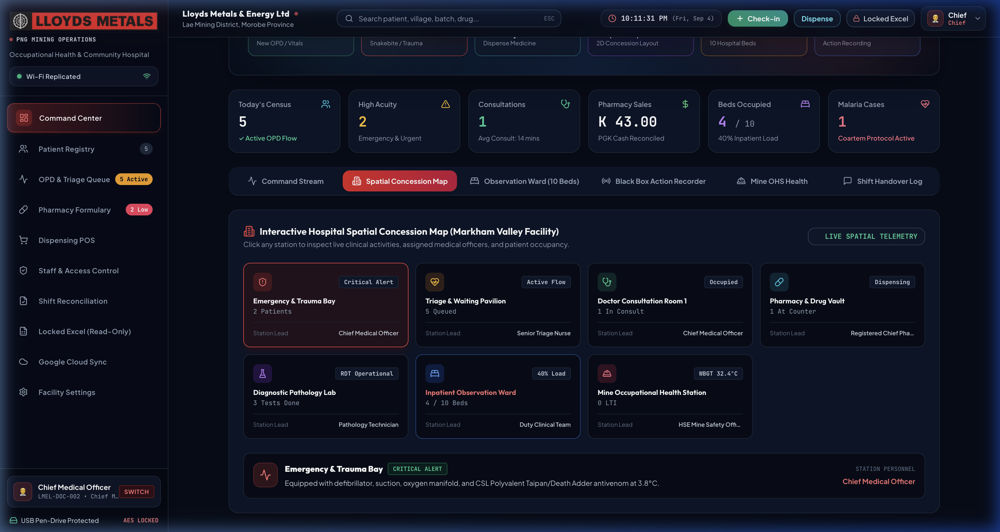
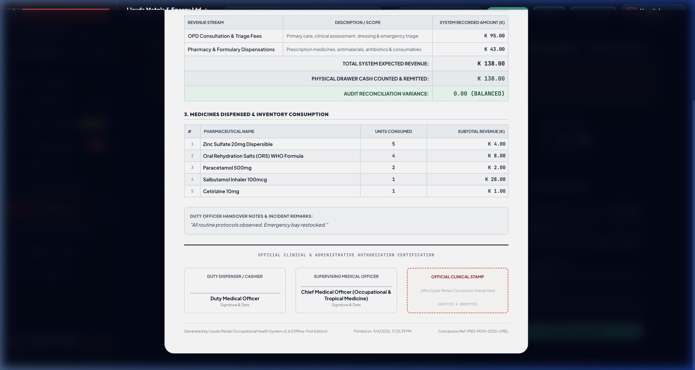
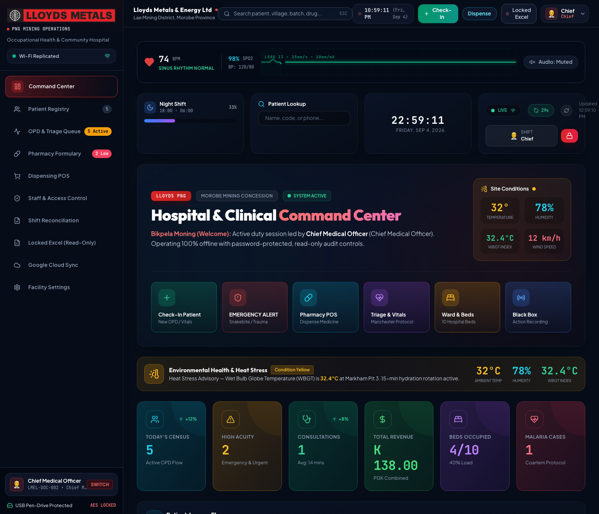
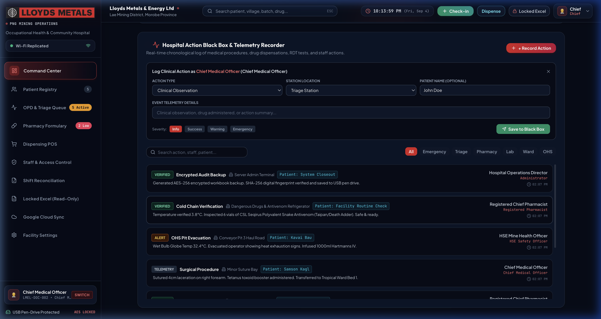
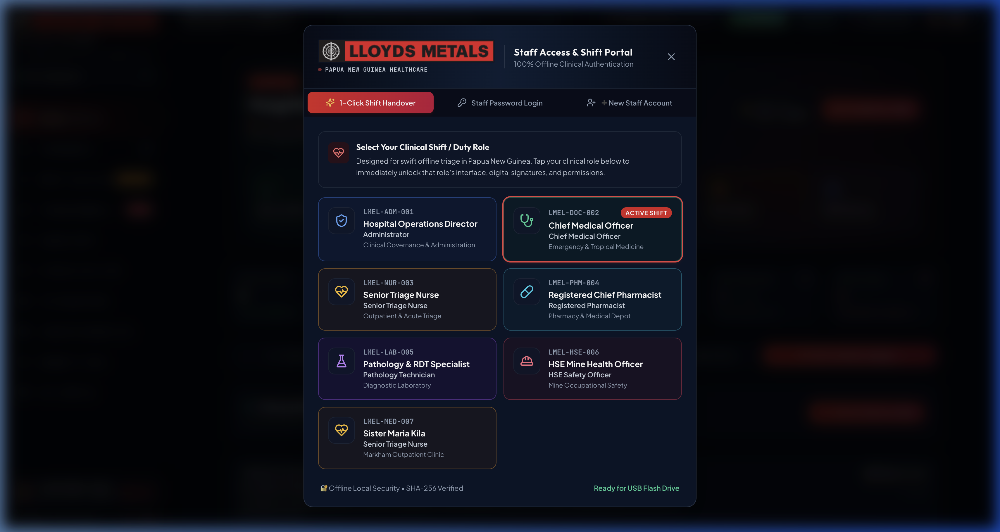

# Lloyds Medical Operating System (LMOS-PNG)
### Occupational Health & Community Hospital Platform — Remote Concessions Edition
**Lloyds Metals & Energy Limited** • *Document Ref: LMEL-TECH-2026-V2.6 | Concession Ref: PNG-MOH-LMEL-2026*

---

[](https://github.com/kritinrautela/lloyds-medical-os)
[](https://github.com/kritinrautela/lloyds-medical-os)
[](https://github.com/kritinrautela/lloyds-medical-os)
[](https://github.com/kritinrautela/lloyds-medical-os)
[](https://github.com/kritinrautela/lloyds-medical-os)
[](https://github.com/kritinrautela/lloyds-medical-os)
[](https://github.com/kritinrautela/lloyds-medical-os)

---

## Table of Contents
1. [Executive Overview & Operational Context](#1-executive-overview--operational-context)
2. [Key Visual Showcase (Command Center & Feature Gallery)](#2-key-visual-showcase)
3. [Core Technical Architecture](#3-core-technical-architecture)
4. [Comprehensive System Modules (A–Z)](#4-comprehensive-system-modules-a-z)
   - [4.1 Command Center & High-Contrast Telemetry HUD](#41-command-center--high-contrast-telemetry-hud)
   - [4.2 OPD Triage & Manchester Emergency Queue](#42-opd-triage--manchester-emergency-queue)
   - [4.3 Date-Stamped Patient Dossier (`LMEL-YYYYMMDD-XXX`)](#43-date-stamped-patient-dossier)
   - [4.4 Inpatient Bed Matrix & Critical Care Beds](#44-inpatient-bed-matrix--critical-care-beds)
   - [4.5 Pharmacy Inventory & PNG Essential Medicines Control](#45-pharmacy-inventory--png-essential-medicines-control)
   - [4.6 Point of Sale (POS) Cashiering & Prescription Dispensation](#46-point-of-sale-pos-cashiering--prescription-dispensation)
   - [4.7 End-of-Day Shift Reconciliation & Cash Drawer Balancing](#47-end-of-day-shift-reconciliation--cash-drawer-balancing)
   - [4.8 AES-256 Encrypted Multi-Tab Excel Export Engine](#48-aes-256-encrypted-multi-tab-excel-export-engine)
   - [4.9 Hybrid Cloud & LAN Relay Synchronization Engine](#49-hybrid-cloud--lan-relay-synchronization-engine)
   - [4.10 Medico-Legal Black Box Activity Flight Recorder](#410-medico-legal-black-box-activity-flight-recorder)
   - [4.11 Concession Spatial Geolocation Tracker](#411-concession-spatial-geolocation-tracker)
   - [4.12 Institutional Multi-Format Printing Engine](#412-institutional-multi-format-printing-engine)
5. [Deployment Topologies & Hardware Configuration](#5-deployment-topologies--hardware-configuration)
6. [Master Access Credentials & User Roles](#6-master-access-credentials--user-roles)
7. [Standard Operating Procedures (Clinic SOPs)](#7-standard-operating-procedures-clinic-sops)
8. [Database Schema & Data Dictionary](#8-database-schema--data-dictionary)
9. [Quick Start & Installation Guide](#9-quick-start--installation-guide)
10. [Executive Manuals & Documentation Suite](#10-executive-manuals--documentation-suite)
11. [Governance, Disclaimers & Audit Rights](#11-governance-disclaimers--audit-rights)

---

## 1. Executive Overview & Operational Context

The **Lloyds Medical Operating System (LMOS-PNG)** is an institutional, mission-critical healthcare platform built exclusively for the remote mining operations and community concessions of **Lloyds Metals & Energy Limited (LMEL)** in Papua New Guinea.

Remote exploration camps and mineral concessions in Papua New Guinea operate under unique environmental and infrastructure constraints:
- **Zero or Intermittent Internet**: Deep jungle valleys, highland terrains, and tropical storms frequently sever satellite and cellular uplinks for days at a time.
- **Dual Clinical Mandate**: Concession medical stations must simultaneously deliver emergency trauma care to heavy machinery operators/drill crews while offering general outpatient consultations, malaria treatment, and prenatal care to surrounding customary landowner villages.
- **Strict Anti-Theft & Financial Accountability**: Pharmaceutical inventory (antibiotics, anti-malarials, surgical consumables) and cash collected from nominal clinic fees must reconcile daily down to `0.00` variance to eliminate pilferage and stock divergence.
- **Medico-Legal Audit Protection**: Mining concession operators require immutable clinical records, timestamped action logs, and physically signed shift handover certificates to satisfy corporate governance, insurance underwriters, and Papua New Guinea National Department of Health (NDoH) auditors.

**LMOS-PNG** solves these challenges by combining a **100% offline-first embedded SQLite engine**, an aerospace-grade high-contrast visual HUD, automated date-based patient identification, and military-grade AES-256 encrypted multi-tab corporate export capabilities.

```
┌───────────────────────────────────────────────────────────────────────────┐
│              LLOYDS MEDICAL OPERATING SYSTEM (LMOS-PNG)                  │
│                                                                           │
│   [Concession Worksite]         [Local Concession Clinic]      [HQ / Sync]│
│   Mine Pit / Exploration ────►  Triage & Vitals Intake   ───►  Offline DB │
│   Heavy Equipment Staff         Doctor Consultation Room       (SQLite 3) │
│   Customary Landowners          Pharmacy & Cashier POS             │      │
│                                 Observation & Trauma Beds          ▼      │
│                                                              Periodic     │
│   [Hardware Form Factor]        [1-Click Run Scripts]        Google Sheet │
│   16GB High-Speed Flash Drive   Windows: .bat | Mac: .command  Sync Relay │
└───────────────────────────────────────────────────────────────────────────┘
```

---

## 2. Key Visual Showcase

### 2.1 Executive Command Center & Real-Time Telemetry HUD
The Command Center acts as the central nerve center for clinic supervisors, displaying real-time patient footfall, active bed occupancy, pharmaceutical stock health alerts, daily revenue, and a live CRT-style ECG oscilloscope with audible heartbeat telemetry.


### 2.2 OPD Triage Queue & Manchester Priority Escalation
The outpatient triage queue visualizes patient waiting times, vital sign abnormal triggers (hypertension, tachycardia, hypoxemia, fever), and Manchester Triage color coding (Red = Immediate, Orange = Very Urgent, Yellow = Urgent, Green = Standard).


### 2.3 Concession Spatial Geolocation & Outbreak Map
An interactive vector cartography map plotting patient origins across concession assets (Mine Pit Alpha, Exploration Camp 1, Gold Processing Mill, Helipad Trauma Hub) and surrounding customary landowner villages (Busu River Settlement, Labu Coastal Enclave, Markham Valley Outpost).



### 2.4 Shift Financial Reconciliation & Cash Drawer Balancing
The end-of-day reconciliation screen audits every nominal fee and pharmacy transaction against physical drawer cash. An automated ledger calculates variance in real-time, enforcing zero-tolerance accountability (`0.00 BALANCED`) before allowing shift closure.


### 2.5 Triple-Sign-Off Official Shift Audit Certificate
Upon closing the shift, the system generates a standardized clinical audit certificate with dedicated sign-off blocks for the Supervising Medical Officer, Senior Triage Nurse, and Finance Officer, complete with an official institutional circular seal.



### 2.6 Real-Time Vitals Telemetry & CRT Oscilloscope
Clinical-grade telemetry with animated systolic/diastolic, heart rate, oxygen saturation, and body temperature indicators featuring color-coded warning thresholds.



### 2.7 Medico-Legal Black Box Flight Recorder
Every medication dispensation, vital sign entry, patient check-in, bed transfer, and credential login is logged in an immutable, timestamped audit stream.



### 2.8 Role-Based Access Control & Staff Security Modal
Staff accounts are partitioned by clinical roles (Master Administrator, Doctor, Triage Nurse, Pharmacist, Cashier) with individual credentials and department assignments.



---

## 3. Core Technical Architecture

LMOS-PNG is engineered to eliminate external cloud dependencies while guaranteeing portability, responsiveness, and zero data loss in remote field operations.

```
┌────────────────────────────────────────────────────────────────────────┐
│                          SYSTEM STACK ARCHITECTURE                     │
├────────────────────────────────────────────────────────────────────────┤
│  PRESENTATION LAYER                                                    │
│  - React 18 (SPA Architecture) with Vite 5 Bundler                    │
│  - Tailwind CSS + Custom Industrial High-Contrast HUD Theme            │
│  - Lucide Vector Iconography & Canvas ECG Oscilloscope                 │
│  - HTML5 Web Audio API Synthesizer (Audible Telemetry & Alarm Sirens)   │
│  - CSS Media Print Engine (@page A4 Portrait, Landscape & 80mm POS)    │
├────────────────────────────────────────────────────────────────────────┤
│  APPLICATION & API LAYER                                               │
│  - Node.js LTS Runtime with Express.js Server Engine                  │
│  - RESTful Micro-Services: /patients, /visits, /drugs, /dispense       │
│  - Excel4Node AES-Protected Multi-Tab Workbook Generator               │
│  - Google Sheets Cloud Relay Sync Queue (Offline Buffer)               │
│  - Static Asset Production Server (serves client/dist directly)       │
├────────────────────────────────────────────────────────────────────────┤
│  DATA STORAGE & PERSISTENCE LAYER                                      │
│  - Embedded SQLite 3 Single-File Engine (server/data/hospital.db)      │
│  - Zero Background Daemon / Zero External Database Driver Setup        │
│  - Foreign Key Constraints & PRAGMA Integrity Checks                   │
│  - Full ACID Transactional Safety for Concurrent Multi-Terminal LAN    │
├────────────────────────────────────────────────────────────────────────┤
│  DEPLOYMENT ENVELOPE                                                   │
│  - Fully Self-Contained on 16GB / 32GB USB Flash Drive                 │
│  - Native 1-Click Launchers: Windows (.bat) and macOS (.command)      │
└────────────────────────────────────────────────────────────────────────┘
```

### Key Architectural Tenets:
1. **Zero External Dependencies**: Does not require Docker, PostgreSQL, MySQL, Redis, or cloud runtimes. A single embedded SQLite database file handles all relational operations.
2. **Deterministic Portability**: The entire codebase, database, and node runtime can be cloned onto a USB flash drive. If a clinic laptop suffers hardware failure, the USB drive can be plugged into any backup laptop, and operations resume within 60 seconds with 100% data intact.
3. **Optimized Resource Footprint**: The client bundle compiles to under 540 KB (gzipped to ~130 KB), and the Express backend operates with under 80 MB of RAM, making it exceptionally fast even on low-power Intel Celeron or Core i3 field laptops.
4. **Offline Queue Buffer**: Network calls to corporate cloud services are fully decoupled. When off-grid, all sync transactions are persisted in local SQLite queues. When camp Wi-Fi or a satellite terminal becomes active, the sync engine flushes data upstream automatically without interrupting clinic workflows.

---

## 4. Comprehensive System Modules (A–Z)

### 4.1 Command Center & High-Contrast Telemetry HUD
- **Real-Time Operational Metrics**: Displays today's patient footfall, active consultations, bed occupancy percentage, pharmacy stock alerts, and daily gross revenue in Papua New Guinea Kina (`PGK / K`).
- **Interactive CRT Oscilloscope**: Canvas-rendered ECG monitor simulating live sinus rhythm with adjustable pulse frequency (40 to 180 BPM) and an optional audible audio pulse toggle powered by the Web Audio API.
- **Critical Action Bar**: 1-click access to **Quick Check-In**, **Dispense POS**, **End of Day Audit**, **Excel Export**, and **Cloud Sync**.
- **Active Bed Status Summary**: Rapid visual gauge of critical care, observation, and isolation beds.

### 4.2 OPD Triage & Manchester Emergency Queue
- **Rapid Intake Modal**: Captures patient name, age, gender, reason for visit, and vital signs in under 30 seconds.
- **Vital Signs Abnormality Detection**: Automatically calculates Mean Arterial Pressure (MAP) and highlights clinical red flags:
  - Systolic BP > 140 mmHg or Diastolic > 90 mmHg (Hypertension alert).
  - Pulse > 100 BPM (Tachycardia alert) or < 60 BPM (Bradycardia).
  - SpO2 < 94% (Hypoxemia warning).
  - Temperature > 38.0°C (Pyrexia / Malaria alert).
- **Four-Tier Triage Escalation**:
  - `Red (Immediate)`: Life-threatening trauma, severe respiratory distress, unresponsiveness.
  - `Orange (Very Urgent)`: Severe lacerations, suspected fractures, acute abdominal pain.
  - `Yellow (Urgent)`: Moderate pyrexia, persistent vomiting, occupational crush injuries.
  - `Green (Standard)`: Routine dressing changes, minor ailments, follow-up consultations.
- **Doctor Clinical Workspace**: Doctors view vitals history, document clinical examinations and differential diagnoses, select prescribed medications from current stock, and click **Save & Send to Pharmacy**, seamlessly routing the patient to the dispensing queue.

### 4.3 Date-Stamped Patient Dossier (`LMEL-YYYYMMDD-XXX`)
To ensure rapid file retrieval and prevent duplicate files across concession clinics, LMOS-PNG generates institutional, date-based patient identification codes:
$$\text{Patient Code Format: } \mathbf{LMEL\text{-}YYYYMMDD\text{-}XXX}$$
- **Date Encoded**: The registration date is permanently embedded in the identifier (e.g., `LMEL-20260904-001` was the first patient registered on September 4, 2026).
- **Collision-Proof Sequential Logic**: The backend scans existing IDs matching the current day's prefix and increments the maximum sequence number, preventing duplicate IDs even across deleted or restored records.
- **Full Dossier View**: Clicking any patient opens a comprehensive medical history drawer displaying:
  - Demographic & provenance data (Province, District, Village/Settlement).
  - Blood group & declared medical allergies.
  - Emergency contacts and past medical history.
  - Chronological visit records with documented vitals, clinical diagnoses, and attending physician names.
  - Complete prescription dispensing history with batch numbers and quantities.

### 4.4 Inpatient Bed Matrix & Critical Care Beds
- **Ward Visual Grid**: Real-time visualization of 10 clinical beds across 5 specialized wards:
  - *Emergency & Trauma Station (Beds ED-01, ED-02)*
  - *Intensive Observation Unit (Beds OBS-01, OBS-02)*
  - *Mine Site Male Inpatient Ward (Beds W-M01, W-M02)*
  - *Community Female Ward (Beds W-F01, W-F02)*
  - *Infectious Disease Isolation Ward (Beds ISO-01, ISO-02)*
- **Patient Allocation & Acuity Levels**: Doctors can assign admitted patients to beds, record admission diagnoses, designate the attending physician, and set acuity ratings (`Critical`, `Guarded`, `Stable`).
- **One-Click Bed Status Toggling**: Instant transition between `Available`, `Occupied`, `Cleaning Required`, and `Maintenance`.

### 4.5 Pharmacy Inventory & PNG Essential Medicines Control
- **Pre-Configured Formulary**: Seeded with essential pharmaceuticals aligned with Papua New Guinea National Department of Health guidelines:
  - *Anti-Malarials*: Artemether + Lumefantrine (Coartem), Quinine Injection, Chloroquine.
  - *Broad-Spectrum Antibiotics*: Amoxicillin/Clavulanate, Ciprofloxacin, Ceftriaxone IV, Doxycycline.
  - *Analgesics & Anti-Inflammatories*: Paracetamol, Ibuprofen, Tramadol, Diclofenac.
  - *Trauma & Emergency Consumables*: Ringer's Lactate IV, Normal Saline 0.9%, Sterile Gauze, Suture Kits, Povidone Iodine.
- **Stock Depletion & Reorder Alerts**: Real-time stock decrementing upon dispensation. Automatic visual badges when stock drops below the minimum safety threshold (default: 20 units).
- **Batch & Expiry Surveillance**: Tracks supplier names, batch/lot numbers, storage conditions (Cold Chain 2–8°C vs. Room Temperature), and flags expiring medicines.

### 4.6 Point of Sale (POS) Cashiering & Prescription Dispensation
- **Instant Prescription Lookup**: Cashiers select waiting patients or load pending prescriptions sent from the doctor's consultation desk.
- **Auto-Calculated Totals**: Automatically aggregates consultation fees and prescribed drug line items.
- **Cash Handover Calculator**: Cashiers enter tender amount (e.g. `100.00 Kina`), and the system immediately displays exact change due.
- **Instant Stock Decrement**: Dispensation immediately decrements database inventory and logs an immutable entry into the Black Box recorder.
- **80mm Thermal Receipt Printing**: Generates standardized paper receipts formatted for thermal receipt printers with company details, patient ID, drug itemization, tax breakdown, and QR code verification.

### 4.7 End-of-Day Shift Reconciliation & Cash Drawer Balancing
- **Automated Financial Aggregation**: Automatically computes total OPD consultation fees collected and total pharmacy sales recorded by the system for the active shift.
- **Physical Cash Count Verification**: The closing cashier enters the physical cash counted in the drawer (banknotes and coins).
- **Variance Audit Engine**:
  $$\text{Variance} = \text{Physical Drawer Cash} - \text{System Total Revenue}$$
  - **Balanced**: Shows high-contrast green indicator `0.00 K (BALANCED)`.
  - **Over / Short**: Flags discrepancy in red with exact Kina shortfall or surplus.
- **Shift Finalization**: Locking the shift generates an immutable record in `end_of_day_reports` and freezes the day's financial books.
- **Triple-Sign-Off Certificate**: Prints an official clinical handover certificate with signature blocks for the Supervising Medical Officer, Senior Triage Nurse, and Finance Officer.

### 4.8 AES-256 Encrypted Multi-Tab Excel Export Engine
- **Corporate Reporting Standard**: Generates an institutional `.xlsx` workbook containing five comprehensive sheets:
  1. *Executive Summary & Revenue Breakdown*
  2. *Patient Census & Demographic Roster*
  3. *Daily OPD Clinical Consultations & Diagnoses*
  4. *Pharmacy Sales & Stock Inventory Levels*
  5. *Inpatient Bed Occupancy & Acuity Audit*
- **Hidden Admin PIN Protection**: To prevent unauthorized tampering or data leaks, the export interface is protected by a hidden Admin PIN console (`lloyds2026`). Entering the correct PIN reveals the workbook decryption key (`png_health_2026`) and triggers the direct download.

### 4.9 Hybrid Cloud & LAN Relay Synchronization Engine
- **Decoupled Architecture**: Clinic laptops operate completely offline without waiting for network timeouts.
- **Automatic Wi-Fi Detection**: The client continuously monitors network connectivity using browser and socket heartbeats.
- **Google Sheets Cloud Mirror**: When an uplink (satellite terminal or mobile hotspot) is detected, the sync worker transmits pending visit and financial records to the designated corporate Google Sheet via secure webhook or Apps Script endpoint.
- **Sync Audit Log**: Full visibility into past synchronization timestamps, record counts, and transmission status (`Success`, `Queued Offline`, `Failed`).

### 4.10 Medico-Legal Black Box Activity Flight Recorder
- **Tamper-Proof Audit Stream**: Every clinical and financial action is permanently cataloged in the `activity_logs` table.
- **Tracked Parameters**: Action type, username, clinical role, patient name, location/ward, technical details, severity level (`Info`, `Warning`, `Critical`), and precise timestamp.
- **Audit Filtering**: Filter audit logs by severity, clinical role, or search keyword to investigate discrepancies or verify patient treatment timelines.

### 4.11 Concession Spatial Geolocation Tracker
- **Concession Asset Mapping**: Visualizes the spatial relationship between industrial mining zones (Active Open Pit, Processing Plant, Crushing Circuit, Explosives Magazine) and residential camp infrastructure (Camp A Accommodations, Executive Mess, Helipad).
- **Community Catchment Mapping**: Plots customary landowner villages across Morobe, Madang, and Enga corridors to identify disease clusters (e.g., malaria spikes in river valley communities).

### 4.12 Institutional Multi-Format Printing Engine
All printable documents are styled with professional CSS `@media print` rules, eliminating UI buttons, sidebars, and dark backgrounds in favor of crisp, black-and-white ink-saving layouts:
1. **Patient Complete Medical File (A4 Portrait)**: Official clinical dossier complete with company header, demographic table, vitals history, past diagnoses, prescription table, and official doctor sign-off blocks.
2. **Daily OPD Patient Census Register (A4 Landscape)**: Comprehensive daily logbook sheet with patient arrival times, triage categories, vital signs, diagnoses, and attending physician initials.
3. **End-of-Day Shift Audit Certificate (A4 Portrait)**: Daily reconciliation certificate featuring company letterhead, financial breakdown, drawer balance indicator, clinical handover notes, triple sign-off blocks, and official stamp circle.
4. **Scannable Patient QR Identity Badges (Credit Card Format)**: Pocket-sized ID card with scannable QR code encoding the patient's unique code, name, and blood group for instant check-in.
5. **Pharmacy Point of Sale Receipts (80mm Thermal)**: Standardized till slip for thermal receipt printers.

---

## 5. Deployment Topologies & Hardware Configuration

LMOS-PNG supports three operational deployment topologies based on concession infrastructure:

```
TOPOLOGY A: Standalone Ruggedized Laptop (Single Device - 100% Offline)
┌─────────────────────────────────────────────────────────────┐
│  [Ruggedized Toughbook Laptop]                              │
│  - USB Pen Drive inserted                                   │
│  - Node.js + Express Backend on localhost:4000              │
│  - React Frontend in Chrome Browser                         │
│  - Local SQLite 3 DB (server/data/hospital.db)              │
│  - USB Thermal Receipt Printer & A4 Laser Printer attached  │
└─────────────────────────────────────────────────────────────┘

TOPOLOGY B: Concession Clinic Local Wi-Fi / LAN Mode (Multi-Device - No Internet Needed)
┌───────────────────────────────────────────────────────────────────────────┐
│  [Local Wi-Fi Router / Ethernet Switch] (No Internet Required)            │
│       │                                │                          │       │
│  ┌────▼─────────────────┐       ┌──────▼────────────┐      ┌──────▼─────┐ │
│  │ Host Clinic Server   │       │ Doctor's Laptop   │      │ Pharmacy   │ │
│  │ (e.g. 192.168.1.100) │       │ Chrome Browser    │      │ POS Tablet │ │
│  │ Runs Node.js Engine  │       │ Reviews Queue &   │      │ Dispenses  │ │
│  │ & Master SQLite DB   │       │ Writes Rx         │      │ Medicines  │ │
│  └──────────────────────┘       └───────────────────┘      └────────────┘ │
└───────────────────────────────────────────────────────────────────────────┘

TOPOLOGY C: Hybrid Cloud Relay (Periodic Satellite Uplink)
┌───────────────────────────────────────────────────────────────────────────┐
│  Concession Clinic LAN (Offline) ──► Satellite Uplink ──► Corporate HQ   │
│  All data stored locally in SQLite    (Starlink / BGAN)   Google Sheets   │
│  Sync queue auto-transmits when uplink is active          Financial Dash  │
└───────────────────────────────────────────────────────────────────────────┘
```

### Hardware Recommendations:
- **Host Laptop**: Intel Core i5 or i7 (or Apple Silicon M-series), 8GB RAM minimum, 256GB SSD, running Windows 10/11 or macOS 12+.
- **Pen Drive**: 16GB or 32GB USB 3.0 / 3.2 High-Speed Flash Drive (Kingston DataTraveler, SanDisk Extreme).
- **Thermal Receipt Printer**: 80mm ESC/POS compatible thermal receipt printer (USB or Network LAN).
- **Document Printer**: Standard A4 Laser or Inkjet printer for shift audit reports and patient medical files.
- **Barcode / QR Scanner**: Any standard USB HID barcode/QR scanner (operates as plug-and-play keyboard wedge).

---

## 6. Master Access Credentials & User Roles

The system is pre-configured with the following institutional accounts:

| User Role | Username | Default Password | Clearance Level & Permissions |
| :--- | :--- | :--- | :--- |
| **Master Administrator** | `admin` | `lloyds2026` | Full administrative authority, staff account creation, system configuration, database reset, security overrides. |
| **Supervising Medical Officer** | `doctor` | `lloyds2026` | OPD queue management, clinical examinations, prescription writing, bed admissions, shift audit sign-off. |
| **Senior Triage Officer** | `triage_officer`| `lloyds2026` | Patient registration, vital signs logging, emergency priority categorization, queue transfers. |
| **Chief Pharmacist** | `pharmacist` | `lloyds2026` | Pharmacy inventory management, batch tracking, stock adjustments, medicine dispensing. |
| **Clinic Cashier** | `cashier` | `lloyds2026` | POS cashiering, consultation and pharmacy fee collection, receipt printing, cash drawer counting. |
| **Hidden Admin PIN** | *(Unlock PIN)* | `lloyds2026` | Unlocks the Excel export console, reveals password, and authorizes encrypted downloads. |

> **Security Notice**: Administrators must change default passwords immediately after initial deployment via the **Staff Management** console.

---

## 7. Standard Operating Procedures (Clinic SOPs)

### SOP 01: Morning Shift Startup
1. Power on the clinic laptop and insert the official Lloyds Medical OS USB flash drive.
2. Launch the server using the 1-click launcher (`Start_Hospital_Windows.bat` or `Start_Hospital_Mac.command`).
3. Open Google Chrome and navigate to `http://localhost:4000`.
4. Log in using your assigned credentials (e.g., `doctor` or `triage_officer`).
5. Open the **Pharmacy** tab and review the **Low Stock Alerts** banner to identify medicines requiring restocking.

### SOP 02: Patient Intake & Date-Based Registration
1. If the patient is visiting for the first time:
   - Click **Register New Patient** in the **Patients** tab.
   - Enter full name, age, gender, province, district, and village/settlement.
   - Click **Register Patient**. The system assigns a unique date-stamped identifier (e.g., `LMEL-20260904-001`).
   - Accept the prompt to automatically transfer the patient into today's OPD queue.
2. If the patient is already registered:
   - Search by name, village, or scan their QR badge.
   - Click **Check-in Today**.
3. Record initial vital signs (Blood Pressure, Heart Rate, SpO2, Temperature, Respiratory Rate).
4. Assign Manchester Triage priority (`Immediate`, `Urgent`, or `Standard`).

### SOP 03: Doctor Examination & Clinical Handover
1. The physician opens the **OPD Queue** tab on their terminal.
2. Click on the patient to review triage vitals and historical clinical dossier.
3. Conduct examination and enter clinical notes and provisional diagnosis.
4. Select prescribed medications and dosage instructions from the pharmacy formulary dropdown.
5. Click **Save & Send to Pharmacy**. The patient automatically transitions to the pharmacy dispensing queue.

### SOP 04: Pharmacy Dispensation & Point of Sale
1. The pharmacist or cashier opens the **Dispense POS** tab.
2. Select the patient from the pending prescription list.
3. Review prescribed drugs, unit quantities, and consultation fees.
4. Collect payment in Papua New Guinea Kina (Cash). Enter the cash tendered to display change due.
5. Click **Dispense & Print Receipt**.
6. Provide the patient with their prescribed medicines and printed 80mm thermal receipt.

### SOP 05: Shift Closeout, Financial Balancing & Eject
1. At the conclusion of the daily shift (18:00 hrs):
   - Open the **End-of-Day** tab.
   - Physically count all banknotes and coins in the cash drawer.
   - Enter the counted cash into the **Physical Cash Counted** input box.
   - Verify that the variance indicator displays **`0.00 K (BALANCED)`**. If a discrepancy exists, investigate prior receipts using the Black Box audit log.
   - Enter shift handover notes in the clinical summary box.
   - Click **Close & Finalize Today's Shift**.
2. Click **Print Shift Audit Report** to print the official A4 Shift Reconciliation Certificate.
3. Obtain physical signatures from the Supervising Medical Officer, Senior Triage Nurse, and Finance Officer.
4. Affix the official clinic ink stamp to the designated seal circle.
5. Click **Safe Pen Drive Eject** to trigger an encrypted backup and safely unmount the drive.

---

## 8. Database Schema & Data Dictionary

The relational database is stored in SQLite 3 format at `server/data/hospital.db` with 14 normalized tables:

```
┌────────────────────────────────────────────────────────────────────────┐
│                        SQLITE DATABASE RELATIONS                       │
├────────────────────────────────────────────────────────────────────────┤
│  hospital_settings  ──► System metadata, currency, clinic name, PIN    │
│  users              ──► Staff credentials, roles, departments, salt    │
│  patients           ──► Demographics, allergies, LMEL-YYYYMMDD-XXX ID │
│       │                                                                │
│       ├──► visits   ──► OPD queue, vitals, triage priority, diagnosis  │
│       │       │                                                        │
│       │       └──► dispensations ──► Invoices, fees, cashier payment   │
│       │                 │                                              │
│       │                 └──► dispensation_items ──► Drug line items    │
│       │                                                                │
│       └──► inpatient_beds ──► Bed allocation, acuity, attending doctor │
│                                                                        │
│  drugs              ──► Formulations, stock, unit price, batch, expiry │
│  end_of_day_reports ──► Daily closing balance, cash variance, sign-off │
│  cloud_sync_config  ──► Google Sheets webhook, sync schedule, state    │
│  sync_logs          ──► History of cloud sync transmissions            │
│  activity_logs      ──► Immutable Black Box flight recorder events     │
│  shift_handover_notes──► Inter-shift doctor and nursing communications │
│  occupational_incidents► Concession OHS injury records & Fit-for-Work  │
└────────────────────────────────────────────────────────────────────────┘
```

### Table 1: `patients` (Master Patient Registry)
| Column | Type | Constraints | Description |
| :--- | :--- | :--- | :--- |
| `id` | INTEGER | PRIMARY KEY AUTOINCREMENT | Internal relational record key. |
| `patient_code` | TEXT | UNIQUE NOT NULL | Date-stamped code: `LMEL-YYYYMMDD-XXX`. |
| `full_name` | TEXT | NOT NULL | Patient full legal name. |
| `age` | INTEGER | NOT NULL | Age in completed years. |
| `gender` | TEXT | NOT NULL | `Male`, `Female`, or `Other`. |
| `phone` | TEXT | | Mobile contact number. |
| `province` | TEXT | | PNG Province (e.g. `Morobe Province`). |
| `district` | TEXT | | Administrative district (e.g. `Lae Urban`). |
| `address_or_village`| TEXT | | Customary village or camp compound name. |
| `blood_group` | TEXT | | Blood ABO/Rh type (e.g. `O+`, `A+`, `B+`). |
| `allergies` | TEXT | | Known drug or environmental allergies. |
| `emergency_contact` | TEXT | | Next of kin contact information. |
| `medical_history` | TEXT | | Pre-existing conditions (Hypertension, Diabetes). |
| `id_card_qr` | TEXT | | Encoded QR string for instant card scanning. |
| `created_at` | DATETIME| DEFAULT CURRENT_TIMESTAMP | Timestamp of initial patient registration. |

### Table 2: `visits` (OPD Daily Queue & Clinical Consultations)
| Column | Type | Constraints | Description |
| :--- | :--- | :--- | :--- |
| `id` | INTEGER | PRIMARY KEY AUTOINCREMENT | Internal visit primary key. |
| `visit_code` | TEXT | UNIQUE NOT NULL | Daily queue sequence number (e.g. `V-20260904-001`).|
| `patient_id` | INTEGER | NOT NULL, FK `patients(id)`| Foreign key link to patient registry. |
| `visit_date` | DATE | NOT NULL | Date of clinical presentation. |
| `reason` | TEXT | | Chief presenting complaint. |
| `triage_priority`| TEXT | DEFAULT 'Standard' | `Immediate`, `Urgent`, or `Standard`. |
| `doctor_name` | TEXT | | Assigned examining physician. |
| `status` | TEXT | DEFAULT 'Waiting' | `Waiting`, `Triage / Vitals`, `In Consultation`, `At Pharmacy`, `Completed`. |
| `bp` | TEXT | | Blood pressure string (e.g. `120/80`). |
| `pulse` | TEXT | | Heart rate in beats per minute. |
| `temp` | TEXT | | Body temperature in Celsius (e.g. `37.2`). |
| `resp_rate` | TEXT | | Respiratory rate per minute. |
| `spo2` | TEXT | | Oxygen saturation percentage (e.g. `98%`). |
| `weight` | TEXT | | Patient weight in kilograms. |
| `doctor_notes` | TEXT | | Clinical examination notes and findings. |
| `diagnosis` | TEXT | | Provisional or confirmed medical diagnosis. |
| `consultation_fee`| REAL | DEFAULT 0.0 | Nominal clinical consultation fee in Kina. |
| `created_at` | DATETIME| DEFAULT CURRENT_TIMESTAMP | Registration timestamp. |
| `completed_at` | DATETIME| | Timestamp when doctor finished examination. |

### Table 3: `drugs` (Pharmaceutical Formulary & Inventory)
| Column | Type | Constraints | Description |
| :--- | :--- | :--- | :--- |
| `id` | INTEGER | PRIMARY KEY AUTOINCREMENT | Internal drug primary key. |
| `code` | TEXT | UNIQUE NOT NULL | Formulary code (e.g. `DRG-AMX-500`). |
| `name` | TEXT | NOT NULL | Brand or trade name. |
| `generic_name` | TEXT | | International Nonproprietary Name (INN). |
| `category` | TEXT | NOT NULL | Therapeutic classification (e.g. `Antibiotics`). |
| `dosage_form` | TEXT | NOT NULL | `Tablet`, `Syrup`, `Capsule`, `Injection`, `IV Fluid`.|
| `strength` | TEXT | | Dosage strength (e.g. `500mg`, `250mg/5ml`). |
| `unit_price` | REAL | NOT NULL | Dispensing price charged to patient in Kina. |
| `cost_price` | REAL | NOT NULL | Procurement cost price. |
| `stock_quantity`| INTEGER | NOT NULL DEFAULT 0 | Current units in physical inventory. |
| `min_stock_alert`| INTEGER | DEFAULT 20 | Threshold triggering low stock warnings. |
| `batch_number` | TEXT | | Manufacturer lot/batch identification. |
| `expiry_date` | DATE | | Expiration date of active batch. |
| `supplier` | TEXT | | Pharmaceutical distributor or donor agency. |
| `storage_condition`| TEXT | DEFAULT 'Room Temperature'| `Room Temperature`, `Cold Chain (2-8°C)`, `Refrigerated`.|

### Table 4: `dispensations` (Sales Transactions & Invoices)
| Column | Type | Constraints | Description |
| :--- | :--- | :--- | :--- |
| `id` | INTEGER | PRIMARY KEY AUTOINCREMENT | Internal invoice identifier. |
| `invoice_number`| TEXT | UNIQUE NOT NULL | Official receipt number (e.g. `INV-20260904-001`).|
| `patient_id` | INTEGER | FK `patients(id)` | Associated patient record. |
| `visit_id` | INTEGER | FK `visits(id)` | Associated clinical visit record. |
| `patient_name` | TEXT | NOT NULL | Patient name on receipt. |
| `total_amount` | REAL | NOT NULL | Total gross invoice amount in Kina. |
| `discount` | REAL | DEFAULT 0.0 | Authorized subsidy or discount in Kina. |
| `paid_amount` | REAL | NOT NULL | Total cash tendered by patient. |
| `payment_method`| TEXT | DEFAULT 'Cash (Kina)' | Form of tender. |
| `payment_status`| TEXT | DEFAULT 'Paid' | `Paid`, `Waived`, `Pending`. |
| `pharmacist_notes`| TEXT | | Dispensation instructions or warnings. |
| `created_at` | DATETIME| DEFAULT CURRENT_TIMESTAMP | Timestamp of transaction. |

---

## 9. Quick Start & Installation Guide

### Method A: 1-Click Launch from USB Flash Drive (Field Staff)
1. Insert the Lloyds Medical USB flash drive into the laptop.
2. Open the drive folder:
   - **On Windows**: Double-click `Start_Hospital_Windows.bat`
   - **On macOS**: Double-click `Start_Hospital_Mac.command`
3. A terminal window will open, start the local server engine, and automatically launch the browser to:
   $$\mathbf{http://localhost:4000}$$
4. Log in with your assigned username and password.

### Method B: Developer & Terminal Setup
If deploying from source code or setting up a new clinic server machine:

#### 1. Clone the Private Repository
```bash
git clone https://github.com/kritinrautela/lloyds-medical-os.git
cd lloyds-medical-os
```

#### 2. Install Server & Client Dependencies
```bash
# Install backend dependencies
cd server
npm install

# Install frontend dependencies
cd ../client
npm install
```

#### 3. Build Production Frontend Bundle
```bash
cd ../client
npm run build
```

#### 4. Launch Production Server
```bash
cd ..
node server/server.js
```
The server will bind to port `4000` and serve both the REST API and the compiled React frontend:
```
============================================================
  LLOYDS MEDICAL OPERATING SYSTEM (LMOS-PNG)
  Version: 2.4.0-PNG | Production Edition
  Embedded SQLite DB: server/data/hospital.db
  Web Interface: http://localhost:4000
============================================================
```

#### 5. Local Multi-Device LAN Setup (Wi-Fi Mode)
To allow other laptops or tablets in the clinic to connect without internet:
1. Connect all clinic devices to the same local Wi-Fi router.
2. Find the IP address of the host laptop (e.g. `192.168.1.105` on Windows or `10.130.98.192` on Mac).
3. On any doctor laptop or pharmacy tablet, open Chrome and navigate to:
   ```
   http://<HOST_IP_ADDRESS>:4000
   ```
   Example: `http://192.168.1.105:4000`

---

## 10. Executive Manuals & Documentation Suite

For comprehensive clinical and operational guidelines, consult the following deliverables located in the `docs/` folder:

| Document | Format | Size | Description | Clickable Link |
| :--- | :--- | :--- | :--- | :--- |
| **Executive PDF Manual** | PDF | 4.7 MB | Complete color manual with embedded UI screenshots, SOPs, and system architecture. | [`docs/Lloyds_Medical_OS_Executive_Manual.pdf`](docs/Lloyds_Medical_OS_Executive_Manual.pdf) |
| **Editable Word Manual** | DOCX | 38 KB | Formatted Microsoft Word deliverable for official submissions and corporate binders. | [`docs/Lloyds_Medical_OS_Executive_Manual.docx`](docs/Lloyds_Medical_OS_Executive_Manual.docx) |
| **Interactive Executive Brief** | HTML | 33 KB | Responsive standalone HTML executive presentation with interactive component breakdowns. | [`docs/Executive_Report_Lloyds_Medical_OS.html`](docs/Executive_Report_Lloyds_Medical_OS.html) |

---

## 11. Governance, Disclaimers & Audit Rights

### Corporate Ownership & Concession Protection
The **Lloyds Medical Operating System (LMOS-PNG)** is proprietary software developed for **Lloyds Metals & Energy Limited (LMEL)** and its associated exploration and mining subsidiaries operating in Papua New Guinea. All intellectual property, database schemas, clinical workflows, and visual designs are strictly confidential.

### Medical Responsibility & Clinical Discretion
LMOS-PNG is a clinical support, triage, and inventory management tool. All medical diagnoses, drug dosages, patient management plans, and fitness-to-work certifications remain the sole professional responsibility of the licensed Supervising Medical Officer on duty.

### Regulatory Alignment
This platform is architected to adhere to the recordkeeping guidelines set forth by:
- **Papua New Guinea National Department of Health (NDoH)**
- **Mineral Resources Authority (MRA) Mining Safety Act**
- **Occupational Health and Safety (OHS) Concession Directives**

---
*Lloyds Metals & Energy Limited • Mining & Occupational Health Division • Papua New Guinea*  
*Document Revision: V2.6-PROD-2026 | Technical Inquiries: contact corporate IT or concessions medical directorate.*
