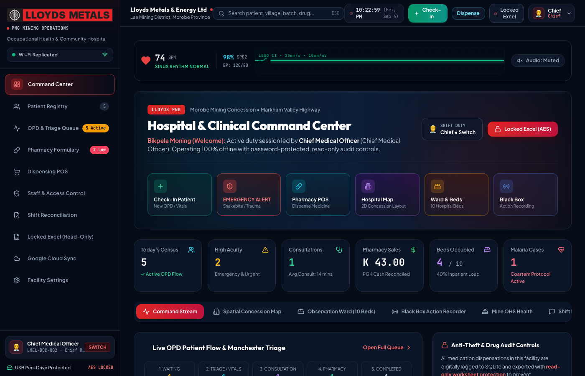
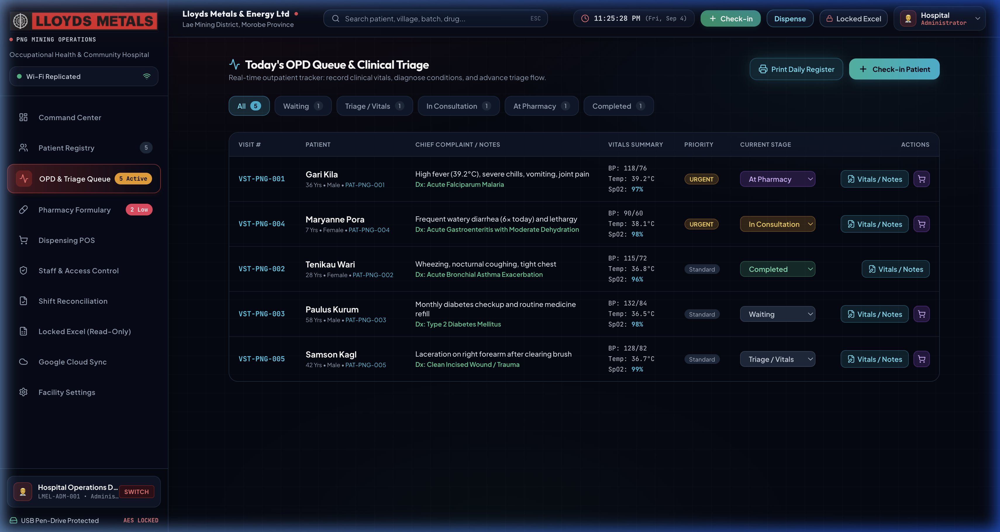
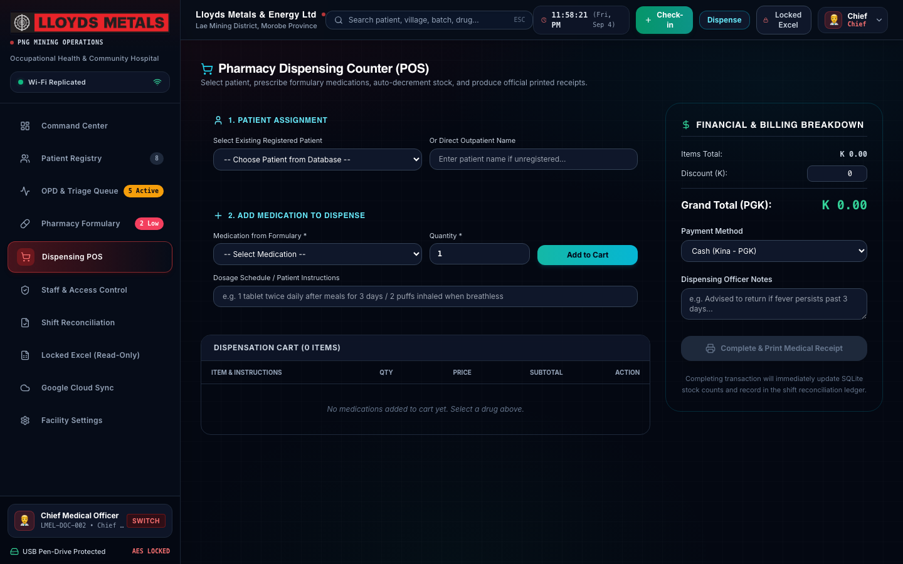
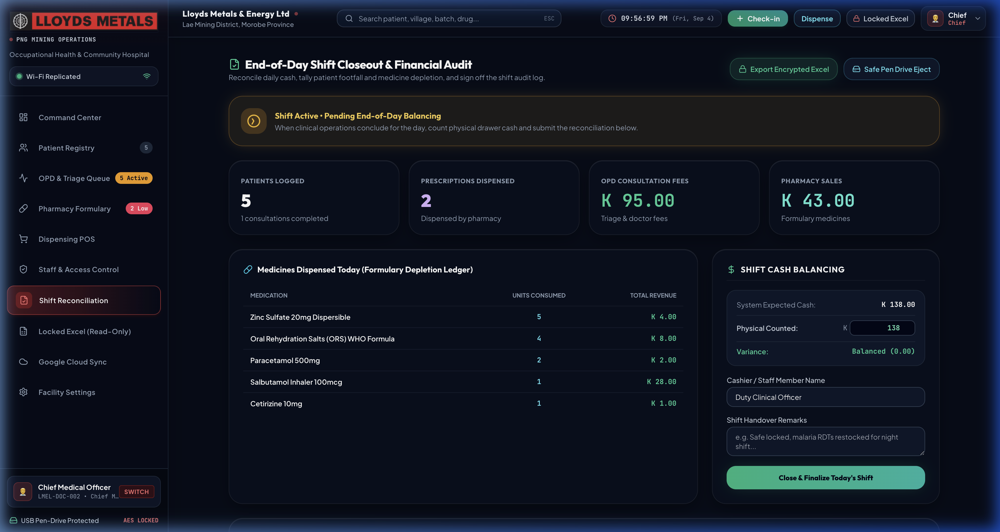

<div align="center">


# 🏥 Lloyds Medical OS

**A complete, offline-first hospital and clinic management system built for remote worksites, mining concessions, and community health centers.**

Runs 100% locally from any laptop or USB drive — zero cloud, zero internet, and zero external database setup required.

[Quick Start](#-quick-start) • [What It Does](#-what-does-this-program-do) • [Default Logins](#-default-logins) • [Screenshots](#-screenshots) • [Tech Stack](#-tech-stack) • [How Data Is Saved](#-where-is-data-stored)

---

</div>

## 💡 Why Lloyds Medical OS?

Most modern hospital software requires constant high-speed internet, cloud subscriptions, and complicated server setups. In remote mining camps, exploration sites, and rural clinics, internet connectivity frequently drops for days or weeks.

**Lloyds Medical OS solves this problem:**
- **Works 100% Offline:** You can run it on a laptop in the middle of the jungle with no internet connection.
- **Instant Setup:** Just double-click a launcher or run one command — no Docker, MySQL, or cloud needed.
- **Multi-Device over Local Wi-Fi:** Doctors, triage nurses, and pharmacists can all use their own laptops or tablets connected to the same clinic Wi-Fi router, even with no internet access.
- **Zero-Loss Accountability:** All patient records, pharmacy sales, and cash collections are saved to a local database and can be exported as password-protected Excel audit sheets.

---

## ⚡ Quick Start: How to Install (Simplest Way)

You only need **a Windows or Mac computer** and **internet for the first time only** (about 5 minutes).
After the first time, it works with **no internet**.

### Step 1 - Download
1. Click this link: **[Download the clinic system (ZIP)](https://github.com/kritinrautela/lloyds-medical-os/archive/refs/heads/main.zip)**
2. Wait for the download to finish. A file called `lloyds-medical-os-main.zip` appears in your **Downloads** folder.

### Step 2 - Open the ZIP (this step is important)
- **Windows:** Right-click the ZIP file -> click **Extract All...** -> click **Extract**.
  (Do not double-click files while they are still inside the ZIP. It will not work.)
- **Mac:** Double-click the ZIP file. A normal folder appears next to it.

Now **drag the new folder onto your Desktop**.

### Step 3 - Start it
Open the folder and double-click **one** file:

| Your computer | Double-click this file |
| :--- | :--- |
| **Windows** | `Start_Hospital_Windows.bat` |
| **Mac** | `Start_Hospital_Mac.command` |

Now wait 2 to 5 minutes. A black window shows what is happening. It installs everything by itself.
**You do not need to install anything else.**

When it says **READY**, your web browser opens by itself.

### Step 4 - Log in
- **If you see "Set up this clinic system":** type your name, choose a username and a password (at least 8 letters), and click **Create the administrator account**. Write the password down.
- **If you see a login screen:** use username `admin` (or `doctor`, `triage_officer`, `pharmacist`) and password `lloyds2026`. The system then asks you to choose a new password.

### Next time
Double-click **Lloyds Medical OS** on your Desktop. It starts in a few seconds.
Keep the black window open while the clinic is working. Close it to stop.

### If the computer shows a warning

| What you see | What to do |
| :--- | :--- |
| **Windows:** "Windows protected your PC" | Click **More info**, then **Run anyway**. |
| **Mac:** "cannot be opened because it is from an unidentified developer" | **Right-click** the file -> **Open** -> **Open**. You only do this once. |
| **Mac:** still will not open | Open **System Settings** -> **Privacy & Security** -> scroll down -> click **Open Anyway**. |
| **Mac:** "no permission" | Open **Terminal**, type `bash ` (with a space), drag `Start_Hospital_Mac.command` into the window, press **Enter**. |
| "No internet connection" | Connect to the internet once and double-click again. |
| Nothing opens in the browser | Open your browser and type `localhost:4000` |
| Anything else | Take a photo of the black window and send it to support. |

### Other computers and tablets in the clinic
Connect them to the same Wi-Fi. On each one, open the browser and type the address shown in the black window
(it looks like `http://192.168.1.50:4000`).

### Before you unplug a USB drive
Double-click `Safe_Pen_Drive_Eject.bat` (Windows) or `Safe_Pen_Drive_Eject.command` (Mac) first.

---

### 💻 Developer Option (Terminal)
If you prefer using the terminal:
```bash
npm run setup    # One-click install for server & client
npm start        # Launches production server on http://localhost:4000
# or for active development: npm run dev
```

---

## 🔑 Default Logins

The system comes pre-configured with 4 ready-to-use staff accounts. All accounts use the same password: **`lloyds2026`**

| Role | Username | Password | What this account does |
| :--- | :--- | :--- | :--- |
| **Doctor / Medical Lead** | `doctor` | `lloyds2026` | Patient consultations, diagnoses, electronic prescriptions, inpatient admissions |
| **Triage Nurse** | `triage_officer` | `lloyds2026` | Patient check-in, vital signs intake (BP, pulse, SpO2, temp), urgent triage sorting |
| **Pharmacist** | `pharmacist` | `lloyds2026` | Medication dispensing, inventory stock counts, batch expiry, Kina cash register |
| **Administrator** | `admin` | `lloyds2026` | Manage staff accounts, reset passwords, change clinic settings, purge demo data |

*(You can create new staff accounts or change passwords anytime from the **Staff Management** page).*

---

## 📋 What Does This Program Do?

Lloyds Medical OS provides an end-to-end clinical workflow from the moment a patient walks in until their medicine is dispensed and the day's cash is counted:

```
[ 1. Check-In ] ──► [ 2. Triage & Vitals ] ──► [ 3. Doctor Consult ] ──► [ 4. Pharmacy & POS ] ──► [ 5. Shift Balancing ]
```

### 1. 🗂️ Patient Registry & Unique ID
- Register new patients in 10 seconds.
- Automatically assigns a unique, date-stamped patient code (e.g. `LMEL-20260906-001`) so patients with similar names are never confused.
- Generates printable digital patient passes and complete medical dossiers.

### 2. 🩺 Triage & Live Vital Signs
- Record Blood Pressure, Heart Rate, Oxygen Saturation (SpO2), Core Temperature, and Respiration.
- Automatic urgency flags for fever, hypertension, tachycardia, and low oxygen.
- Real-time telemetry monitor showing clinic status.

### 3. 👨‍⚕️ Doctor Consultation Suite & Clinical Decision Support (CDS)
- **Live Waiting Queue:** Real-time visibility into triaged patients, waiting duration, and triage priority.
- **Automated Hemodynamic CDS:** Real-time calculation of **Shock Index (`HR / SBP`)**, **Mean Arterial Pressure (MAP)**, and **NEWS2 Risk Scoring** bar.
- **Patient Allergy Cross-Check:** Instant pulsing warning banner if a patient has documented sensitivities (e.g. Penicillin, Sulphonamides, Aspirin).
- **1-Click ICD-10 Diagnostic Presets:** Instant diagnostic coding for PNG regional emergencies (*Falciparum Malaria B50.9*, *Snake Venom T63.0*, *Blast Trauma T14.1*, *Heat Exhaustion T67.0*).
- **Rapid Diagnostic Test (RDT) Ordering:** 1-click lab orders for Malaria RDT, 20-Min Whole Blood Clotting Test (20WBCT), Blood Glucose, Dengue NS1, and FBC.
- **Electronic Prescriptions:** Authorize medication orders directly sent to the dispensary.

### 4. 💊 Pharmacy, Stock Control & POS Cashier
- Pre-loaded with essential medicines (antimalarials, CSL antivenom, antibiotics, IV fluids, analgesics).
- Automatic inventory decrement upon prescription dispensation with batch tracking and FEFO expiry guards.
- Point of Sale (POS) cashiering collecting consultation fees & medication costs in PNG Kina (PGK) with A4 itemized tax invoices.

### 5. 🛏️ Inpatient Ward Census & Bed Management (10 Beds)
- Interactive admission & discharge for 10 specialized ward bays (*Emergency Resuscitation, Snakebite Toxicology, Mine OHS, Tropical Medicine, Minor Surgical*).
- Clinical Acuity categorization: *Resuscitation (Acuity 1)*, *High Dependency (Acuity 2)*, *Urgent (Acuity 3)*, *Moderate (Acuity 4)*, and *Stable (Acuity 5)*.
- Live attending doctor tracking, telemetry vitals ticker, and decontamination/sanitization status workflow.

### 6. 💰 End-of-Day Financial Balancing & Shift Handover
- Reconciles total consultation fees + pharmacy sales against physical cash in the clinic safe.
- Enforces zero-variance balancing (`0.00`) before shift closure to prevent theft and drug diversion.
- Shift handover digital logbook passed seamlessly across Day & Night shifts without page reloads.

### 7. ☁️ Offline-First with Hybrid Google Drive & Sheets Sync
- **100% Offline Local SQLite WAL:** Operates uninterrupted with zero internet access.
- **1-Click Google Drive Data Pack:** Download a multi-table bundle (.JSON + multi-sheet CSV tables for Patients, Visits, Pharmacy, Dispensations, Inpatient Beds, and OHS Incidents).
- **Embedded Google Sheets Formulas:** Pre-configured with `=SUM()`, `=COUNTIF()`, and `=AVERAGE()` formulas for instant cloud analytics.
- **Automatic Wi-Fi Detection:** Background auto-sync flushes queued shift records to Google Drive and webhook endpoints the moment clinic Wi-Fi detects an active internet uplink.

### 8. 🔒 Tamper-Proof Black Box & Encrypted Excel
- **Black Box Recorder:** Every admission, prescription dispensation, check-in, and settings modification is recorded in a cryptographically sequenced audit log.
- **AES-256 Encrypted Excel:** Generates corporate-grade, password-protected multi-tab Excel workbooks (decryption PIN: `lloyds2026`).

---

## 📸 Screenshots

| Command Center & Clinical Dashboard | OPD Triage Queue |
| :---: | :---: |
|  |  |

| Pharmacy Formulary & Dispensing POS | End-of-Day Financial Shift Balancing |
| :---: | :---: |
|  |  |

---

## 📶 Using Tablets & Multiple Computers on Clinic Wi-Fi

You can connect tablets, phones, and secondary laptops in the clinic **without any internet**:

1. Connect the host computer and your tablets to the **same Wi-Fi router** (the router does not need to be plugged into the internet).
2. Find the IP address of the main computer running the system:
   - On Windows: Run `ipconfig` in Command Prompt (e.g. `192.168.1.50`)
   - On Mac: Check System Settings > Wi-Fi Details
3. On your tablets or laptops, open the browser and go to:
   ```
   http://192.168.1.50:4000
   ```
   *(Replace with your computer's actual IP address)*

Now the Triage Nurse, Doctor, and Pharmacist can all work on their own screens simultaneously!

---

## 💾 Where Is Data Stored?

Everything is saved locally on your computer in a single file:
```
server/data/hospital.db
```
- **Engine:** SQLite 3 with Write-Ahead Logging (WAL) enabled.
- **Safety:** Even if the power cuts or the computer abruptly shuts down, your data is safe and will not corrupt.
- **Privacy:** No patient records or financial numbers are ever sent to external cloud servers.
- **Clearing Demo Data:** If you want to wipe sample test data and start fresh for a real clinic, go to **Facility Settings** and click **"Purge Demo Data & Start Clean"**.

---

## 🛠️ Tech Stack

- **Frontend:** [React 18](https://react.dev/), [Vite](https://vitejs.dev/), [Tailwind CSS](https://tailwindcss.com/), Lucide Icons
- **Backend:** [Node.js](https://nodejs.org/), [Express.js](https://expressjs.com/)
- **Database:** [SQLite 3](https://www.sqlite.org/) (WAL mode)
- **Reporting:** `excel4node` (AES-256 encrypted multi-tab Excel workbooks)
- **Printing:** Standard CSS Paged Media for 80mm thermal receipts and A4 audit certificates

---

## 📁 Project Structure

```text
lloyds-medical-os/
├── Start_Hospital_Windows.bat   # 1-Click launcher for Windows
├── Start_Hospital_Mac.command   # 1-Click launcher for Mac
├── Safe_Pen_Drive_Eject.bat     # Flushes database safely before USB removal
├── client/                      # React frontend application
│   ├── src/
│   │   ├── pages/               # Dashboard, Patients, Triage, Pharmacy, POS, Settings
│   │   ├── components/          # Modals, Navbar, Sidebar, Telemetry cards
│   │   └── services/api.js      # Local API connection
├── server/                      # Node.js backend & SQLite database
│   ├── data/hospital.db         # The single SQLite database file holding all data
│   ├── routes/                  # API endpoints (patients, visits, drugs, auth, etc.)
│   └── server.js                # Express web server
└── docs/                        # Complete 20-page executive PDF manual and assets
```

---

## 📖 Full Executive Manual

For formal hospital documentation, clinical protocols, and accreditation details, see:
- 📄 **[Executive Manual (20-Page PDF)](docs/Lloyds_Medical_OS_Executive_Manual.pdf)**
- 🏥 **[Clinical Staff Protocol Guide](README_HOSPITAL_STAFF.md)**
- 💾 **[USB Pen-Drive Quick Instructions](00_START_HERE.txt)**

---

## 🏢 Organization & License

Built for **Lloyds Panguna Metals and Energy Limited**  
Occupational Health, Mining Concessions & Community Health Division.  
*All rights reserved.*
